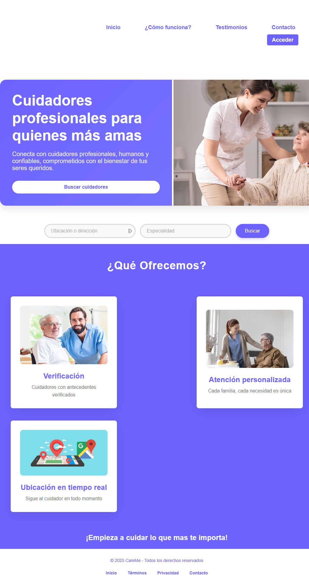
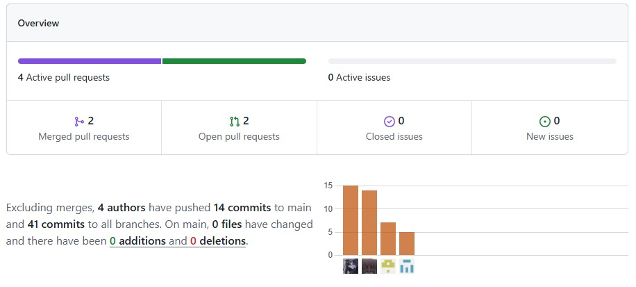

    

<h1 align="center">
    Universidad Peruana de Ciencias Aplicadas
</h1>

<h3 align="center">
    Carrera: Ingeniería de Software
       
    Curso: SI729 - Desarrollo de Aplicaciones Open Source
       
    Sección: 4344
       
    Profesor: Rafael Oswaldo Castro Veramendi
       
    Ciclo: 2025-01 
       
    Informe de Trabajo Final
       
    Startup: MediTech
       
    Producto: CareMe  
</h3>

| 
Alumno
 | 
Código
 |
|:-------------------------------------:|:-------------------------------------:|
|        Roque Tello, Jack Eddie              |              u20221c448               |
|       Bottger Salazar, Johan Karl       |              u202210735               |
|          Lapa de la Cruz, Gabriel Omar          |              u202216831               |
|         Santos Torres, Juan Manuel         |              u20221a371               |
|        Stanley Gutierrez, Tume        |              u202118152               |

 Abril 2025 

## Registro de Versiones del Informe

| Versión | Fecha | 
Autor(es) 
 | 
Descripción de la modificación
 |
|:-------:|:-----:|:-----------------------------------------:|-------------------------------------------------------------|
| TB1 | 25/04/2025 | - Roque Tello, Jack - Bottger Salazar, Johan Karl - Santos Torres, Juan Manuel  | Para esta entrega se han desarrollado los siguientes capítulos:  - Carátula - Registro de Versiones del Informe - Project Report Collaboration Insights - Contenido - Student Outcome - Capítulo I: Introducción - Capítulo II: Requirements Elicitation & Analysis - Capítulo III: Requirements Specification - Capítulo IV: Product Design - Capítulo V: Product Implementation, Validation & Deployment - 5.1. Software Configuration Management - 5.1.1. Software Development Environment Configuration - 5.1.2. Source Code Management - 5.1.3. Source Code Style Guide & Conventions - 5.1.4. Software Deployment Configuration - 5.2. Landing Page, Services & Applications Implementation - 5.2.1. Sprint 1 - 5.2.1.1. Sprint Planning 1 - 5.2.1.2. Aspect Leaders and Collaborators - 5.2.1.3. Sprint Backlog 1 - 5.2.1.4. Development Evidence for Sprint Review - 5.2.1.5. Execution Evidence for Sprint Review - 5.2.1.6. Services Documentation Evidence for Sprint Review - 5.2.1.7. Software Deployment Evidence for Sprint Review - 5.2.1.8. Team Collaboration Insights during Sprint - Avance de Conclusiones, Bibliografía y Anexos |

## Project Report Collaboration Insights  

Nuestro Project Report se encuentra en el siguiente repositorio de GitHub: 

🔗[https://github.com/MediTecOpen/docs/tree/main/docs](https://github.com/MediTecOpen/docs/tree/main).

- **Flujo de trabajo adoptado**

    Durante el desarrollo colaborativo de este repositorio, hemos decidido adoptar el flujo de trabajo GitHub Flow, debido a su simplicidad, escalabilidad y orientación a la integración continua. Este flujo nos ha permitido:

    - Crear ramas individuales por cada integrante y sección asignada.
    - Realizar pull requests para revisión de cambios antes de integrarlos a la rama principal.
    - Discutir observaciones mediante comentarios en los commits o PRs.
    - Asegurar la integración progresiva, ordenada y sin conflictos del contenido en el informe final.

    Además, hemos establecido una convención de nombres para las ramas utilizando el siguiente esquema: cap[numero-capitulo], lo que facilita la identificación de la sección en proceso de edición. Del mismo modo, los mensajes de commit son claros y están formulados siguiendo la semántica de los commits convencionales, lo que mejora la trazabilidad y comprensión del historial de cambios.
### Colaboración por Entrega

- **TB1:**
    Para la Primera Entrega (TB1) del Project Report, cada miembro del equipo participó activamente en la redacción de secciones específicas. La coordinación se realizó de forma asincrónica y vía reuniones breves en línea para consensuar estilos de redacción y criterios de inclusión.

    - Asignación de secciones por miembro:
        - Roque Tello, Jack Eddie (UPC-Skylar): Capitulo 1 , Capitulo 2
        - Todos: Capitulo 5

  

## Tabla de Contenidos

[Registro de Versiones del Informe](#registro-de-versiones-del-informe)

[Project Report Collaboration Insights](#project-report-collaboration-insights)

[Tabla de Contenidos](#tabla-de-contenidos)

[Student Outcome](#student-outcome)

[Capítulo I: Introducción](#capítulo-i-introducción)
  - [1.1. Startup Profile](#11-startup-profile)
    - [1.1.1. Descripción de la Startup](#111-descripción-de-la-startup)
    - [1.1.2. Perfiles de Integrantes del Equipo](#112-perfiles-de-integrantes-del-equipo)
  - [1.2. Solution Profile](#12-solution-profile)
    - [1.2.1. Antecedentes y Problemática](#121-antecedentes-y-problemática)
    - [1.2.2. Lean UX Process](#122-lean-ux-process)
      - [1.2.2.1. Lean UX Problem Statements](#1221-lean-ux-problem-statements)
      - [1.2.2.2. Lean UX Assumptions](#1222-lean-ux-assumptions)
      - [1.2.2.3. Lean UX Hypothesis Statements](#1223-lean-ux-hypothesis-statements)
      - [1.2.2.4. Lean UX Canvas](#1224-lean-ux-canvas)
  - [1.3. Segmentos Objetivos](#13-segmentos-objetivos)

[Capítulo II: Requirements Elicitation & Analysis](#capítulo-ii-requirements-elicitation--analysis)
  - [2.1. Competidores](#21-competidores)
    - [2.1.1. Análisis competitivo](#211-análisis-competitivo)
    - [2.1.2. Estrategias y tácticas frente a competidores](#212-estrategias-y-tácticas-frente-a-competidores)
  - [2.2. Entrevistas](#22-entrevistas)
    - [2.2.1. Diseño de entrevistas](#221-diseño-de-entrevistas)
    - [2.2.2. Registro de entrevistas](#222-registro-de-entrevistas)
    - [2.2.3. Análisis de entrevistas](#223-análisis-de-entrevistas)
  - [2.3. Needfinding](#23-needfinding)
    - [2.3.1. User Personas](#231-user-personas)
    - [2.3.2. User Task Matrix](#232-user-task-matrix)
    - [2.3.3. User Journey Mapping](#233-user-journey-mapping)
    - [2.3.4. Empathy Mapping](#234-empathy-mapping)
        - [2.3.4.1. Empathy Mapping Turistas nacionales e internacionales](#2341-empathy-mapping-turistas-nacionales-e-internacionales)
        - [2.3.4.2. Empathy Mapping Agencias de turismo locales](#2342-empathy-mapping-agencias-de-turismo-locales)
        - [2.3.4.3. Empathy Mapping Viajeros por trabajo](#2343-empathy-mapping-viajeros-por-trabajo)
    - [2.3.5. As-is Scenario Mapping](#235-as-is-scenario-mapping)
        - [2.3.5.1. As-is Scenario Mapping Turistas nacionales e internacionales](#2351-as-is-scenario-mapping-turistas-nacionales-e-internacionales)
        - [2.3.5.2. As-is Scenario Mapping Agencias de turismo locales](#2352-as-is-scenario-mapping-agencias-de-turismo-locales)
        - [2.3.5.3. As-is Scenario Mapping Viajeros por trabajo](#2353-as-is-scenario-mapping-viajeros-por-trabajo)
  - [2.4. Ubiquitous Language](#24-ubiquitous-language)

[Capítulo III: Requirements Specification](#capítulo-iii-requirements-specification)
  - [3.1. To-Be Scenario Mapping](#31-to-be-scenario-mapping)
    - [3.1.1. To-Be Scenario Mapping Personas que necesitan Cuidado para un familiar por horas](#311-to-Be-scenario-personas-que-necesitan-cuidado)
    - [3.1.2. To-Be Scenario Mapping Cuidadores Profesionales](#312-to-Be-scenario-mapping-cuidadores-profesionales)

#### 3.1.2. To-Be Scenario Mapping Cuidadores Profesionales
  - [3.2. User Stories](#32-user-stories)
  - [3.3. Impact Mapping](#33-impact-mapping)
  - [3.4. Product Backlog](#34-product-backlog)

[Capítulo IV: Product Design](#capítulo-iv-product-design)
  - [4.1. Style Guidelines](#41-style-guidelines)
    - [4.1.1. General Style Guidelines](#411-general-style-guidelines)
    - [4.1.2. Web Style Guidelines](#412-web-style-guidelines)
  - [4.2. Information Architecture](#42-information-architecture)
    - [4.2.1. Organization Systems](#421-organization-systems)
    - [4.2.2. Labeling Systems](#422-labeling-systems)
    - [4.2.3. SEO Tags and Meta Tags](#423-seo-tags-and-meta-tags)
    - [4.2.4. Searching Systems](#424-searching-systems)
    - [4.2.5. Navigation Systems](#425-navigation-systems)
  - [4.3. Landing Page UI Design](#43-landing-page-ui-design)
    - [4.3.1. Landing Page Wireframe](#431-landing-page-wireframe)
    - [4.3.2. Landing Page Mock-up](#432-landing-page-mock-up)
  - [4.4. Web Applications UX/UI Design](#44-web-applications-uxui-design)
    - [4.4.1. Web Applications Wireframes](#441-web-applications-wireframes)
    - [4.4.2. Web Applications Wireflow Diagrams](#442-web-applications-wireflow-diagrams)
    - [4.4.3. Web Applications Mock-ups](#443-web-applications-mock-ups)
    - [4.4.4. Web Applications User Flow Diagrams](#444-web-applications-user-flow-diagrams)
  - [4.5. Web Applications Prototyping](#45-web-applications-prototyping)
  - [4.6. Domain-Driven Software Architecture](#46-domain-driven-software-architecture)
    - [4.6.1. Software Architecture Context Diagrams](#461-software-architecture-context-diagrams)
    - [4.6.2. Software Architecture Container Diagrams](#462-software-architecture-container-diagrams)
    - [4.6.3. Software Architecture Components Diagrams](#463-software-architecture-components-diagrams)
  - [4.7. Software Object-Oriented Design](#47-software-object-oriented-design)
    - [4.7.1. Class Diagrams](#471-class-diagrams)
    - [4.7.2. Class Dictionary](#472-class-dictionary)
  - [4.8. Database Design](#48-database-design)
    - [4.8.1. Database Diagram](#481-database-diagram)

[Capítulo V: Product Implementation, Validation & Deployment](#capítulo-v-product-implementation-validation--deployment)
  - [5.1. Software Configuration Management](#51-software-configuration-management)
    - [5.1.1. Software Development Environment Configuration](#511-software-development-environment-configuration)
    - [5.1.2. Source Code Management](#512-source-code-management)
    - [5.1.3. Source Code Style Guide & Conventions](#513-source-code-style-guide-conventions)
    - [5.1.4. Software Deployment Configuration](#514-software-deployment-configuration)
  - [5.2. Landing Page, Services & Applications Implementation](#52-landing-page-services--applications-implementation)
    - [5.2.1. Sprint 1](#521-sprint-1)
      - [5.2.1.1. Sprint Planning 1](#5211-sprint-planning-1)
      - [5.2.1.2. Aspect Leaders and Collaborators](#5212-aspect-leaders-and-collaborators)
      - [5.2.1.3. Sprint Backlog 1](#5213-sprint-backlog-1)
      - [5.2.1.4. Development Evidence for Sprint Review](#5214-development-evidence-for-sprint-review)
      - [5.2.1.5. Execution Evidence for Sprint Review](#5215-execution-evidence-for-sprint-review)
      - [5.2.1.6. Services Documentation Evidence for Sprint Review](#5216-services-documentation-evidence-for-sprint-review)
      - [5.2.1.7. Software Deployment Evidence for Sprint Review](#5217-software-deployment-evidence-for-sprint-review)
      - [5.2.1.8. Team Collaboration Insights during Sprint](#5218-team-collaboration-insights-during-sprint)

[Conclusiones](#conclusiones)

[Bibliografía](#bibliografía)

[Anexos](#anexos)

## Student Outcome

El curso contribuye al cumplimiento del Student Outcome ABET:

**ABET – EAC - Student Outcome 3**

Criterio: Capacidad de comunicarse efectivamente con un rango de audiencias. 
En el siguiente cuadro se describe las acciones realizadas y enunciados de conclusiones por parte del grupo,
que permiten sustentar el haber alcanzado el logro del ABET – EAC - Student Outcome 3.

| 
Criterio específico
 | 
Acciones Realizadas
 | 
Conclusiones
 |
|:-------------------:|-------------------|------------|
|Comunica oralmente con efectividad a diferentes rangos de audiencia| **- Jack Tello**   **TB1:** En esta entrega me encargué de comunicarle a mi equipo cuál sería la metodología de trabajo. Además, participé activamente en la revisión retroactiva de los avances de mis compañeros. También apoyé en la preparación del material de presentación para nuestras reuniones internas.  **TP:**   **TB2:**   **TF:**   | **TB1:** Consideramos que para las proximas entregas debemos mantener una comunicación activa y eficaz que fortalezca la confianza, y por ende, el trabajo en equipo, un valor crucial para proyectos colaborativos.|
|Comunica por escrito con efectividad a diferentes rangos de audiencia| **- Jack Tello**   **TB1** Colabore con la elaboración de las pautas y alineamientos que nuestro equipo seguiría durante el proceso de desarrollo de software. Asimismo, me encargue de elaborar el Capitulo 1 y 2.   **TP:**   **TB2:**   **TF:**    

## Capítulo I: Introducción 

### 1.1. Startup Profile

#### 1.1.1. Descripción de la Startup

#### 1.1.2. Perfiles de Integrantes del Equipo

#### 1.2. Solution Profile

#### 1.2.1. Antecedentes y problemática

#### 1.2.2. Lean UX Process

#### 1.2.2.1. Lean UX Problem Statements

#### 1.2.2.2. Lean UX Assumptions

#### 1.2.2.3. Lean UX Hypothesis Statements

#### 1.2.2.4. Lean UX Canvas

### 1.3. Segmentos Objetivos

## Capítulo II: Requirements Elicitation & Analysis

### 2.1. Competidores

#### 2.1.1. Análisis competitivo

#### 2.1.2. Estrategias y tácticas frente a competidores

### 2.2. Entrevistas

#### 2.2.1. Diseño de entrevistas

#### 2.2.2. Registro de entrevistas

#### 2.2.3. Análisis de entrevistas

### 2.3. Needfinding

#### 2.3.1. User Personas

#### 2.3.2. User Task Matrix

#### 2.3.3. User Journey Mapping

#### 2.3.4. Empathy Mapping

#### 2.3.4.1. Empathy Mapping Turistas nacionales e internacionales

#### 2.3.4.2. Empathy Mapping Agencias de turismo locales

#### 2.3.4.3. Empathy Mapping Viajeros por trabajo

#### 2.3.5. As-is Scenario Mapping

#### 2.3.5.1. As-is Scenario Mapping Turistas nacionales e internacionales

#### 2.3.5.2. As-is Scenario Mapping Agencias de turismo locales

#### 2.3.5.3. As-is Scenario Mapping Viajeros por trabajo

### 2.4. Ubiquitous Language

## Capítulo III: Requirements Specification

### 3.1. To-Be Scenario Mapping

#### 3.1.1. To-Be Scenario Mapping Personas que necesitan Cuidado para un familiar por Horas

#### 3.1.2. To-Be Scenario Mapping Cuidadores Profesionales

### 3.2. User Stories

### 3.3. Impact Mapping

### 3.4. Product Backlog

## Capítulo IV: Product Design

### 4.1. Style Guidelines

#### 4.1.1. General Style Guidelines

#### 4.1.2. Web Style Guidelines

### 4.2. Information Architecture

#### 4.2.1. Organization Systems

#### 4.2.2. Labeling Systems

#### 4.2.3. SEO Tags and Meta Tags

#### 4.2.4. Searching Systems

#### 4.2.5. Navigation Systems

### 4.3. Landing Page UI Design

#### 4.3.1. Landing Page Wireframe

#### 4.3.2. Landing Page Mock-up

### 4.4. Web Applications UX/UI Design

#### 4.4.1. Web Applications Wireframes.

#### 4.4.2. Web Applications Wireflow Diagrams

#### 4.4.3. Web Applications Mock-ups

#### 4.4.4. Web Applications User Flow Diagrams

### 4.5. Web Applications Prototyping

### 4.6. Domain-Driven Software Architecture

#### 4.6.1. Software Architecture Context Diagrams

#### 4.6.2. Software Architecture Container Diagrams

#### 4.6.3. Software Architecture Components Diagrams

### 4.7. Software Object-Oriented Design

#### 4.7.1. Class Diagrams

#### 4.7.2. Class Dictionary

### 4.8. Database Design

#### 4.8.1. Database Diagram

## Capítulo V: Product Implementation, Validation & Deployment

### 5.1. Software Configuration Management.

#### 5.1.1. Software Development Environment Configuration.
Esta sección detalla las herramientas utilizadas durante el desarrollo del software, organizadas según las distintas fases del proyecto.

---

## 🗂 Project Management

- **[Google Meet](https://meet.google.com/):**  
  Plataforma utilizada para realizar reuniones virtuales con los miembros del equipo. Permite compartir pantalla, imágenes, texto y video, todo en tiempo real. Es compatible con navegadores web, dispositivos móviles y computadoras, y solo requiere una cuenta activa para su uso.

- **[Trello](https://trello.com/home):**  
  Herramienta visual para la gestión de tareas del proyecto. Nos permite organizar y hacer seguimiento a tareas pendientes, en proceso y completadas. Su interfaz por tableros facilita la coordinación y visibilidad del avance del equipo. Se accede fácilmente desde un navegador tras crear una cuenta.

---

## 📋 Requirement Management

- **[Trello](https://trello.com/home):**  
  También lo empleamos para gestionar los requisitos del sistema. Su diseño intuitivo permite trabajar colaborativamente en el backlog, definir prioridades y alinear los objetivos del equipo con las funcionalidades a desarrollar.

---

## 🎨 Product UX/UI Design

- **[UXpressia](https://uxpressia.com/):**  
  Fue clave para construir perfiles detallados de usuarios, mapear sus emociones, metas y comportamientos mediante herramientas como User Personas, Journey Maps y Empathy Maps.

- **[Figma](https://www.figma.com/):**  
  Plataforma colaborativa de diseño usada para crear wireframes y mockups. Su facilidad para compartir y editar en tiempo real la convirtió en una herramienta fundamental en el desarrollo de interfaces visuales.

---

## 💻 Software Development

### 🔹 Landing Page

- **Tecnologías utilizadas:**  
  HTML5, CSS3 y JavaScript.  
  Se usó **Bootstrap** para lograr un diseño responsivo y acelerar el desarrollo de una interfaz adaptable a diversos dispositivos.

### 🔹 IDEs de desarrollo

- **[Visual Studio Code](https://code.visualstudio.com/):**  
  Usamos este IDE por su rendimiento, facilidad de uso y herramientas integradas para la edición, depuración y control de versiones. Fue esencial para implementar la landing page de forma ágil y ordenada.

- **[GitHub](https://github.com/):**  
  Plataforma para alojar el repositorio del proyecto y gestionar el control de versiones del código fuente y la documentación, facilitando la colaboración y el seguimiento de cambios.

---

## 🚀 Software Deployment

- **GitHub Pages:**  
  Utilizamos GitHub Pages para desplegar la landing page de forma gratuita y directamente desde el repositorio del proyecto. Esta herramienta permite alojar sitios estáticos fácilmente, integrándose con el flujo de trabajo de GitHub y facilitando una publicación continua con cada cambio en el repositorio.

---

## 📝 Software Documentation

- **[Google Drive](https://drive.google.com/drive/home):**  
  Utilizamos Google Docs para redactar y mantener la documentación del proyecto de forma colaborativa. Esta herramienta facilita la edición en tiempo real entre los miembros del equipo, asegurando que toda la información esté organizada y accesible desde cualquier dispositivo.

- **[Canva](https://www.canva.com/):**  
  Empleamos Canva para la creación de material visual y presentaciones gráficas del proyecto. Su interfaz sencilla e intuitiva permite diseñar documentos importantes que ayudan a comunicar ideas de forma clara y profesional.

- **Markdown:**  
  Un lenguaje de marcado ligero y sencillo para crear documentos con formato, empleándose para redactar la documentación del proyecto de manera clara y estructurada.

#### 5.1.2. Source Code Management
---

##### 🔧 Gestión de Repositorios en GitHub

El proyecto se desarrolló en **GitHub**, donde se creó una organización dedicada con repositorios específicos para cada módulo del sistema, cada uno estructurado con sus respectivas ramas. Esta plataforma facilitó:

- La gestión del código fuente.
- El control de versiones.
- La colaboración entre los desarrolladores.

Durante los próximos **sprints**, se implementará la metodología **Git Flow** para mantener una estructura de trabajo ordenada, permitiendo:

- Una integración controlada de nuevas funcionalidades.
- Correcciones eficientes.
- Gestión de lanzamientos estables.

Esta combinación garantiza un flujo de trabajo eficiente y una coordinación efectiva dentro del equipo de desarrollo.

### 📁 Repositorios GitHub

- **Landing Page:** [https://github.com/MediTecOpen/LandingPage](https://github.com/MediTecOpen/LandingPage)
- **Documentación:** [https://github.com/MediTecOpen/docs](https://github.com/MediTecOpen/docs)
- **Frontend:** [https://github.com/MediTecOpen/Frontend](https://github.com/MediTecOpen/Frontend)

#### 5.1.3. Source Code Style Guide & Conventions

#### 5.1.4. Software Deployment Configuration

### 5.2. Landing Page, Services & Applications Implementation

#### 5.2.1. Sprint 1

##### 5.2.1.1. Sprint Planning 1

## SPRINT 1

| Section                        | Item                          | Details                                                                                       |
|--------------------------------|-------------------------------|-----------------------------------------------------------------------------------------------|
| **Sprint Planning Background** | **Date**                      | 20-04-2024                                                                                     |
|                                | **Time**                      | 18:00 PM                                                                                       |
|                                | **Location**                  | Videoconferencia mediante Google Meet                                                         |
|                                | **Prepared By**               | Jack Roque, Johan Bottger, Gabriel Lapa de la Cruz, Juan Santos, Stanley Gutierrez            |
|                                | **Attendees**                 | Jack Roque, Johan Bottger, Gabriel Lapa de la Cruz, Juan Santos, Stanley Gutierrez            |
|                                | **Sprint Review Summary**     | N.A.                                                                                           |
|                                | **Sprint Retrospective Summary** | N.A.                                                                                       |
| **Sprint Goal and User Stories** | **Goal for Sprint 1**        | Diseñar e implementar el Landing Page con el objetivo de concretar nuestra propuesta de valor. Documentación. |
|                                | **Sprint 1 Velocity**         | 12                                                                                            |
|                                | **Sum of Story Points**       | 12                                                                                            |

##### 5.2.1.2. Aspect Leaders and Collaborators

##### 5.2.1.3. Sprint Backlog 1

### Sprint # - Sprint 1

| User Story ID | User Story Title                   | Task ID | Task Title             | Description                                                                                   | Estimation | Assigned         | Status      |
|---------------|------------------------------------|---------|------------------------|-----------------------------------------------------------------------------------------------|------------|------------------|-------------|
| 24            | Contenido de Landing Page          | 01      | Estructura             | Desarrollar la estructura del landing page siguiendo los lineamientos de Estilo establecidos | 3 hrs      | Not Yet Assigned | Done        |
|               |                                    | 02      | Contenido              | Poblar la landing page con información relevante sobre servicio                              | 2 hrs      | Not Yet Assigned | Done        |
| 23            | Registro desde Landing Page        | 03      | Opción Registrarse     | Implementar funcionalidad de Botón de registro                                                | 2 hrs      | Not Yet Assigned | Done        |
|               |                                    | 04      | Formulario de Registro | Desarrollar formulario de registro                                                            | 3 hrs      | Not Yet Assigned | To Do       |
| 22            | Visualizar Contenido por dispositivo | 05     | Responsive Web Page     | Configurar la landing page de manera responsiva para que se adapte a distintos dispositivos  | 2 hrs      | Not Yet Assigned | In progress |

##### 5.2.1.4. Development Evidence for Sprint Review

| Repository       | Branch        | Commit ID                             | Commit Message                                 | Committed On     |
|------------------|---------------|----------------------------------------|------------------------------------------------|------------------|
| Docs      | Cap1        |  5864622…0865a5f                            | Update README.md                                 | 25-04-2025     |
| Docs      | Cap2        |  752c40d…75ad395                            | feat: add User Persona                                 | 25-04-2025     |
| Docs      | Cap3        |  be67e9d…c06272d                            | Update README.md                                 | 25-04-2025     |
| Docs      | Cap4        |  0fc968d…3ad04d1                            | Update README.md                                 | 25-04-2025     |
| Docs      | Cap5        |  0fc968d…59e5941                            | Capitulo 5 primer commitE.md                                 | 25-04-2025     |

##### 5.2.1.5. Execution Evidence for Sprint Review

Durante este Sprint, se completó la implementación del diseño y la estructura básica de la Landing Page para el proyecto Care me, utilizando los avances de diseño de Figma. A continuación, se presentan las vistas clave de la Landing Page.

##### 5.2.1.6. Services Documentation Evidence for Sprint Review

No aplicable para primer sprint.

##### 5.2.1.7. Software Deployment Evidence for Sprint Review

Vistas del Landing Page desplegado en:  https://meditecopen.github.io/LandingPage/#

##### 5.2.1.8. Team Collaboration Insights during Sprint

## Conclusiones

-Durante el desarrollo de la Landing Page, el equipo de CareMe ha logrado implementar con éxito las funcionalidades y características planificadas, proporcionando una experiencia de usuario sólida y coherente.

-La implementación de la Landing Page ha permitido al equipo demostrar su capacidad para traducir los requisitos y especificaciones en código funcional, desarrollando una estructura sólida y un diseño visual atractivo.

 -La implementación de la Landing Page ha sentado las bases para el desarrollo de la Web Application, que se espera completar en etapas posteriores del proyecto.

## Bibliografía

## Anexos
