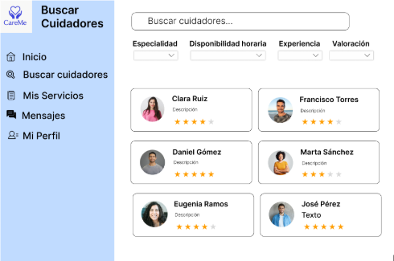

    

<h1 align="center">
    Universidad Peruana de Ciencias Aplicadas
</h1>

<h3 align="center">
    Carrera: Ingeniería de Software
       
    Curso: SI729 - Desarrollo de Aplicaciones Open Source
       
    Sección: 4344
       
    Profesor: Rafael Oswaldo Castro Veramendi
       
    Ciclo: 2025-01 
       
    Informe de Trabajo Final
       
    Startup: MediTech
       
    Producto: CareMe  
</h3>

| 
Alumno
 | 
Código
 |
|:-------------------------------------:|:-------------------------------------:|
|        Roque Tello, Jack Eddie              |              u20221c448               |
|       Bottger Salazar, Johan Karl       |              u202210735               |
|          Lapa de la Cruz, Gabriel Omar          |              u202216831               |
|         Santos Torres, Juan Manuel         |              u20221a371               |
|        Stanley Gutierrez, Tume        |              u202118152               |

 Abril 2025 

## Registro de Versiones del Informe

| Versión | Fecha | 
Autor(es) 
 | 
Descripción de la modificación
 |
|:-------:|:-----:|:-----------------------------------------:|-------------------------------------------------------------|
| TB1 | 25/04/2025 | - Roque Tello, Jack - Bottger Salazar, Johan Karl - Santos Torres, Juan Manuel  | Para esta entrega se han desarrollado los siguientes capítulos:  - Carátula - Registro de Versiones del Informe - Project Report Collaboration Insights - Contenido - Student Outcome - Capítulo I: Introducción - Capítulo II: Requirements Elicitation & Analysis - Capítulo III: Requirements Specification - Capítulo IV: Product Design - Capítulo V: Product Implementation, Validation & Deployment - 5.1. Software Configuration Management - 5.1.1. Software Development Environment Configuration - 5.1.2. Source Code Management - 5.1.3. Source Code Style Guide & Conventions - 5.1.4. Software Deployment Configuration - 5.2. Landing Page, Services & Applications Implementation - 5.2.1. Sprint 1 - 5.2.1.1. Sprint Planning 1 - 5.2.1.2. Aspect Leaders and Collaborators - 5.2.1.3. Sprint Backlog 1 - 5.2.1.4. Development Evidence for Sprint Review - 5.2.1.5. Execution Evidence for Sprint Review - 5.2.1.6. Services Documentation Evidence for Sprint Review - 5.2.1.7. Software Deployment Evidence for Sprint Review - 5.2.1.8. Team Collaboration Insights during Sprint - Avance de Conclusiones, Bibliografía y Anexos |

## Project Report Collaboration Insights  

Nuestro Project Report se encuentra en el siguiente repositorio de GitHub: 

🔗[https://github.com/MediTecOpen/docs/tree/main/docs](https://github.com/MediTecOpen/docs/tree/main).

- **Flujo de trabajo adoptado**

    Durante el desarrollo colaborativo de este repositorio, hemos decidido adoptar el flujo de trabajo GitHub Flow, debido a su simplicidad, escalabilidad y orientación a la integración continua. Este flujo nos ha permitido:

    - Crear ramas individuales por cada integrante y sección asignada.
    - Realizar pull requests para revisión de cambios antes de integrarlos a la rama principal.
    - Discutir observaciones mediante comentarios en los commits o PRs.
    - Asegurar la integración progresiva, ordenada y sin conflictos del contenido en el informe final.

    Además, hemos establecido una convención de nombres para las ramas utilizando el siguiente esquema: cap[numero-capitulo], lo que facilita la identificación de la sección en proceso de edición. Del mismo modo, los mensajes de commit son claros y están formulados siguiendo la semántica de los commits convencionales, lo que mejora la trazabilidad y comprensión del historial de cambios.
### Colaboración por Entrega

- **TB1:**
    Para la Primera Entrega (TB1) del Project Report, cada miembro del equipo participó activamente en la redacción de secciones específicas. La coordinación se realizó de forma asincrónica y vía reuniones breves en línea para consensuar estilos de redacción y criterios de inclusión.

    - Asignación de secciones por miembro:
        - Roque Tello, Jack Eddie (UPC-Skylar): Capitulo 1 , Capitulo 2
        - Todos: Capitulo 5

  

## Tabla de Contenidos

[Registro de Versiones del Informe](#registro-de-versiones-del-informe)

[Project Report Collaboration Insights](#project-report-collaboration-insights)

[Tabla de Contenidos](#tabla-de-contenidos)

[Student Outcome](#student-outcome)

[Capítulo I: Introducción](#capítulo-i-introducción)
  - [1.1. Startup Profile](#11-startup-profile)
    - [1.1.1. Descripción de la Startup](#111-descripción-de-la-startup)
    - [1.1.2. Perfiles de Integrantes del Equipo](#112-perfiles-de-integrantes-del-equipo)
  - [1.2. Solution Profile](#12-solution-profile)
    - [1.2.1. Antecedentes y Problemática](#121-antecedentes-y-problemática)
    - [1.2.2. Lean UX Process](#122-lean-ux-process)
      - [1.2.2.1. Lean UX Problem Statements](#1221-lean-ux-problem-statements)
      - [1.2.2.2. Lean UX Assumptions](#1222-lean-ux-assumptions)
      - [1.2.2.3. Lean UX Hypothesis Statements](#1223-lean-ux-hypothesis-statements)
      - [1.2.2.4. Lean UX Canvas](#1224-lean-ux-canvas)
  - [1.3. Segmentos Objetivos](#13-segmentos-objetivos)

[Capítulo II: Requirements Elicitation & Analysis](#capítulo-ii-requirements-elicitation--analysis)
  - [2.1. Competidores](#21-competidores)
    - [2.1.1. Análisis competitivo](#211-análisis-competitivo)
    - [2.1.2. Estrategias y tácticas frente a competidores](#212-estrategias-y-tácticas-frente-a-competidores)
  - [2.2. Entrevistas](#22-entrevistas)
    - [2.2.1. Diseño de entrevistas](#221-diseño-de-entrevistas)
    - [2.2.2. Registro de entrevistas](#222-registro-de-entrevistas)
    - [2.2.3. Análisis de entrevistas](#223-análisis-de-entrevistas)
  - [2.3. Needfinding](#23-needfinding)
    - [2.3.1. User Personas](#231-user-personas)
    - [2.3.2. User Task Matrix](#232-user-task-matrix)
    - [2.3.3. User Journey Mapping](#233-user-journey-mapping)
    - [2.3.4. Empathy Mapping](#234-empathy-mapping)
        - [2.3.4.1. Empathy Mapping Turistas nacionales e internacionales](#2341-empathy-mapping-turistas-nacionales-e-internacionales)
        - [2.3.4.2. Empathy Mapping Agencias de turismo locales](#2342-empathy-mapping-agencias-de-turismo-locales)
        - [2.3.4.3. Empathy Mapping Viajeros por trabajo](#2343-empathy-mapping-viajeros-por-trabajo)
    - [2.3.5. As-is Scenario Mapping](#235-as-is-scenario-mapping)
        - [2.3.5.1. As-is Scenario Mapping Turistas nacionales e internacionales](#2351-as-is-scenario-mapping-turistas-nacionales-e-internacionales)
        - [2.3.5.2. As-is Scenario Mapping Agencias de turismo locales](#2352-as-is-scenario-mapping-agencias-de-turismo-locales)
        - [2.3.5.3. As-is Scenario Mapping Viajeros por trabajo](#2353-as-is-scenario-mapping-viajeros-por-trabajo)
  - [2.4. Ubiquitous Language](#24-ubiquitous-language)

[Capítulo III: Requirements Specification](#capítulo-iii-requirements-specification)
  - [3.1. To-Be Scenario Mapping](#31-to-be-scenario-mapping)
    - [3.1.1. To-Be Scenario Mapping Personas que necesitan Cuidado para un familiar por horas](#311-to-Be-scenario-personas-que-necesitan-cuidado)
    - [3.1.2. To-Be Scenario Mapping Cuidadores Profesionales](#312-to-Be-scenario-mapping-cuidadores-profesionales)

#### 3.1.2. To-Be Scenario Mapping Cuidadores Profesionales
  - [3.2. User Stories](#32-user-stories)
  - [3.3. Impact Mapping](#33-impact-mapping)
  - [3.4. Product Backlog](#34-product-backlog)

[Capítulo IV: Product Design](#capítulo-iv-product-design)
  - [4.1. Style Guidelines](#41-style-guidelines)
    - [4.1.1. General Style Guidelines](#411-general-style-guidelines)
    - [4.1.2. Web Style Guidelines](#412-web-style-guidelines)
  - [4.2. Information Architecture](#42-information-architecture)
    - [4.2.1. Organization Systems](#421-organization-systems)
    - [4.2.2. Labeling Systems](#422-labeling-systems)
    - [4.2.3. SEO Tags and Meta Tags](#423-seo-tags-and-meta-tags)
    - [4.2.4. Searching Systems](#424-searching-systems)
    - [4.2.5. Navigation Systems](#425-navigation-systems)
  - [4.3. Landing Page UI Design](#43-landing-page-ui-design)
    - [4.3.1. Landing Page Wireframe](#431-landing-page-wireframe)
    - [4.3.2. Landing Page Mock-up](#432-landing-page-mock-up)
  - [4.4. Web Applications UX/UI Design](#44-web-applications-uxui-design)
    - [4.4.1. Web Applications Wireframes](#441-web-applications-wireframes)
    - [4.4.2. Web Applications Wireflow Diagrams](#442-web-applications-wireflow-diagrams)
    - [4.4.3. Web Applications Mock-ups](#443-web-applications-mock-ups)
    - [4.4.4. Web Applications User Flow Diagrams](#444-web-applications-user-flow-diagrams)
  - [4.5. Web Applications Prototyping](#45-web-applications-prototyping)
  - [4.6. Domain-Driven Software Architecture](#46-domain-driven-software-architecture)
    - [4.6.1. Software Architecture Context Diagrams](#461-software-architecture-context-diagrams)
    - [4.6.2. Software Architecture Container Diagrams](#462-software-architecture-container-diagrams)
    - [4.6.3. Software Architecture Components Diagrams](#463-software-architecture-components-diagrams)
  - [4.7. Software Object-Oriented Design](#47-software-object-oriented-design)
    - [4.7.1. Class Diagrams](#471-class-diagrams)
    - [4.7.2. Class Dictionary](#472-class-dictionary)
  - [4.8. Database Design](#48-database-design)
    - [4.8.1. Database Diagram](#481-database-diagram)

[Capítulo V: Product Implementation, Validation & Deployment](#capítulo-v-product-implementation-validation--deployment)
  - [5.1. Software Configuration Management](#51-software-configuration-management)
    - [5.1.1. Software Development Environment Configuration](#511-software-development-environment-configuration)
    - [5.1.2. Source Code Management](#512-source-code-management)
    - [5.1.3. Source Code Style Guide & Conventions](#513-source-code-style-guide-conventions)
    - [5.1.4. Software Deployment Configuration](#514-software-deployment-configuration)
  - [5.2. Landing Page, Services & Applications Implementation](#52-landing-page-services--applications-implementation)
    - [5.2.1. Sprint 1](#521-sprint-1)
      - [5.2.1.1. Sprint Planning 1](#5211-sprint-planning-1)
      - [5.2.1.2. Aspect Leaders and Collaborators](#5212-aspect-leaders-and-collaborators)
      - [5.2.1.3. Sprint Backlog 1](#5213-sprint-backlog-1)
      - [5.2.1.4. Development Evidence for Sprint Review](#5214-development-evidence-for-sprint-review)
      - [5.2.1.5. Execution Evidence for Sprint Review](#5215-execution-evidence-for-sprint-review)
      - [5.2.1.6. Services Documentation Evidence for Sprint Review](#5216-services-documentation-evidence-for-sprint-review)
      - [5.2.1.7. Software Deployment Evidence for Sprint Review](#5217-software-deployment-evidence-for-sprint-review)
      - [5.2.1.8. Team Collaboration Insights during Sprint](#5218-team-collaboration-insights-during-sprint)

[Conclusiones](#conclusiones)

[Bibliografía](#bibliografía)

[Anexos](#anexos)

## Student Outcome

El curso contribuye al cumplimiento del Student Outcome ABET:

**ABET – EAC - Student Outcome 3**

Criterio: Capacidad de comunicarse efectivamente con un rango de audiencias. 
En el siguiente cuadro se describe las acciones realizadas y enunciados de conclusiones por parte del grupo,
que permiten sustentar el haber alcanzado el logro del ABET – EAC - Student Outcome 3.

| 
Criterio específico
 | 
Acciones Realizadas
 | 
Conclusiones
 |
|:-------------------:|-------------------|------------|
|Comunica oralmente con efectividad a diferentes rangos de audiencia| **- Jack Tello**   **TB1:** En esta entrega me encargué de comunicarle a mi equipo cuál sería la metodología de trabajo. Además, participé activamente en la revisión retroactiva de los avances de mis compañeros. También apoyé en la preparación del material de presentación para nuestras reuniones internas.  **TP:**   **TB2:**   **TF:**   | **TB1:** Consideramos que para las proximas entregas debemos mantener una comunicación activa y eficaz que fortalezca la confianza, y por ende, el trabajo en equipo, un valor crucial para proyectos colaborativos.|
|Comunica por escrito con efectividad a diferentes rangos de audiencia| **- Jack Tello**   **TB1** Colabore con la elaboración de las pautas y alineamientos que nuestro equipo seguiría durante el proceso de desarrollo de software. Asimismo, me encargue de elaborar el Capitulo 1 y 2.   **TP:**   **TB2:**   **TF:**    

## Capítulo I: Introducción 

### 1.1. Startup Profile

#### 1.1.1. Descripción de la Startup

#### 1.1.2. Perfiles de Integrantes del Equipo

#### 1.2. Solution Profile

#### 1.2.1. Antecedentes y problemática

#### 1.2.2. Lean UX Process

#### 1.2.2.1. Lean UX Problem Statements

#### 1.2.2.2. Lean UX Assumptions

#### 1.2.2.3. Lean UX Hypothesis Statements

#### 1.2.2.4. Lean UX Canvas

### 1.3. Segmentos Objetivos

## Capítulo II: Requirements Elicitation & Analysis

### 2.1. Competidores

#### 2.1.1. Análisis competitivo

#### 2.1.2. Estrategias y tácticas frente a competidores

### 2.2. Entrevistas

#### 2.2.1. Diseño de entrevistas

#### 2.2.2. Registro de entrevistas

#### 2.2.3. Análisis de entrevistas

### 2.3. Needfinding

#### 2.3.1. User Personas

#### 2.3.2. User Task Matrix

#### 2.3.3. User Journey Mapping

#### 2.3.4. Empathy Mapping

#### 2.3.4.1. Empathy Mapping Turistas nacionales e internacionales

#### 2.3.4.2. Empathy Mapping Agencias de turismo locales

#### 2.3.4.3. Empathy Mapping Viajeros por trabajo

#### 2.3.5. As-is Scenario Mapping

#### 2.3.5.1. As-is Scenario Mapping Turistas nacionales e internacionales

#### 2.3.5.2. As-is Scenario Mapping Agencias de turismo locales

#### 2.3.5.3. As-is Scenario Mapping Viajeros por trabajo

### 2.4. Ubiquitous Language

## Capítulo III: Requirements Specification

### 3.1. To-Be Scenario Mapping

#### 3.1.1. To-Be Scenario Mapping Personas que necesitan Cuidado para un familiar por Horas

#### 3.1.2. To-Be Scenario Mapping Cuidadores Profesionales

### 3.2. User Stories

### 3.3. Impact Mapping

### 3.4. Product Backlog

## Capítulo IV: Product Design
### 4.1. Style Guidelines

#### 4.1.1. General Style Guidelines

#### 4.1.2. Web Style Guidelines

### 4.2. Information Architecture

#### 4.2.1. Organization Systems

#### 4.2.2. Labeling Systems

#### 4.2.3. SEO Tags and Meta Tags

#### 4.2.4. Searching Systems

#### 4.2.5. Navigation Systems

### 4.3. Landing Page UI Design

#### 4.3.1. Landing Page Wireframe

#### 4.3.2. Landing Page Mock-up

### 4.4. Web Applications UX/UI Design

#### 4.4.1. Web Applications Wireframes.

#### 4.4.2. Web Applications Wireflow Diagrams

#### 4.4.3. Web Applications Mock-ups

#### 4.4.4. Web Applications User Flow Diagrams

Segmento objetivo: Solicitantes y Cuidadores 

User goal: Como solicitante, quiero tener la capacidad de encontrar y seleccionar fácilmente a los cuidadores más adecuados para las necesidades de mi familiar.
Descripción: En el siguiente wireframe se muestra los pasos que debe seguir para encontrar un cuidador.

### 4.5. Web Applications Prototyping

### 4.6. Domain-Driven Software Architecture

#### 4.6.1. Software Architecture Context Diagrams

#### 4.6.2. Software Architecture Container Diagrams

#### 4.6.3. Software Architecture Components Diagrams

### 4.7. Software Object-Oriented Design
#### 4.7.1. Class Diagrams

#### 4.7.2. Class Dictionary

 * Clase: Usuario

Descripción: Clase base que representa a cualquier usuario de la plataforma.

Atributos:

id: String – Identificador único del usuario.

nombre: String – Nombre completo del usuario.

correo: String – Correo electrónico.

contraseña: String – Contraseña cifrada.

teléfono: String – Número de contacto.

rol: String – Rol del usuario (Solicitante o Cuidador).

* Clase: Solicitante (hereda de Usuario)

Descripción: Usuario que contrata servicios de cuidado.

Atributos:

dirección: String – Dirección de domicilio.

historial Servicios: List<Servicio> – Lista de servicios contratados.

metodoPago: MetodoPago – Método de pago asociado.

Métodos:

agendarServicio() – Programa un nuevo servicio.

cancelarServicio() – Cancela un servicio agendado.

* Clase: Cuidador (hereda de Usuario)

Descripción: Profesional de salud que brinda servicios a través de la plataforma.

Atributos:

especialidad: String – Especialización médica o técnica.

experiencia: Int – Años de experiencia.

disponibilidad: String – Días y horarios disponibles.

certificaciones: List<String> – Certificados y validaciones.

calificaciones: List<Reseña> – Valoraciones recibidas.

Métodos:

aceptarServicio() – Acepta una solicitud de servicio.

completarServicio() – Marca un servicio como completado.

* Clase: Servicio

Descripción: Representa una sesión de cuidado entre un solicitante y un cuidador.

Atributos:

id: String – Identificador del servicio.

fecha: Date – Fecha del servicio.

duracionHoras: Int – Duración en horas.

estado: String – Estado del servicio (pendiente, en curso, completado).

solicitante: Solicitante – Usuario que contrata.

cuidador: Cuidador – Profesional que ofrece el servicio.

Métodos:

iniciar() – Cambia el estado del servicio a "en curso".

finalizar() – Finaliza el servicio.

* Clase: MetodoPago

Descripción: Representa un método de pago registrado por el usuario.

Atributos:

tipo: String – Tipo (tarjeta, transferencia, etc.).

datos: String – Información codificada o token del método.

Métodos:

procesarPago() – Realiza la operación de pago.

* Clase: Pago

Descripción: Transacción financiera generada por un servicio.

Atributos:

id: String – ID único del pago.

monto: Float – Valor a pagar.

estado: String – Estado del pago (pendiente, procesado).

metodo: MetodoPago – Método utilizado.

Métodos:

generarRecibo() – Emite un comprobante de pago.

*Clase: Reseña

Descripción: Valoración emitida por el solicitante al finalizar un servicio.

Atributos:

puntuacion: Int – Puntuación del 1 al 5.

comentario: String – Opinión escrita.

autor: Solicitante – Usuario que emite la reseña.

Métodos:

mostrar() – Muestra la reseña.

*Clase: Mensaje

Descripción: Mensaje enviado entre usuarios a través del sistema de mensajería.

Atributos:

contenido: String – Texto del mensaje.

fecha: Date – Fecha y hora de envío.

emisor: Usuario – Usuario que envió el mensaje.

receptor: Usuario – Usuario que lo recibió.

* Clase: Notificacion

Descripción: Notificación enviada a los usuarios por eventos importantes.

Atributos:

titulo: String – Título de la notificación.

mensaje: String – Contenido del mensaje.

destinatario: Usuario – Usuario que la recibe.

Métodos:

enviar() – Envía la notificación al destinatario.

### 4.8. Database Design
#### 4.8.1. Database Diagram

ENTIDADES:

* Usuarios
Esta entidad representa a las personas que utilizan el sistema. Un usuario puede ser un solicitante, un cuidador, o tener otro rol dentro del sistema.

id: Identificador único del usuario (clave primaria).

nombre: Nombre completo del usuario.

correo: Dirección de correo electrónico del usuario.

contraseña: Contraseña de acceso para autenticar al usuario.

telefono: Número de teléfono del usuario.

rol: Define el tipo de usuario (por ejemplo, "solicitante" o "cuidador").

* Solicitantes
Los solicitantes son los usuarios que piden servicios a los cuidadores. Esta entidad almacena información sobre los solicitantes y sus métodos de pago.

id_usuario: Referencia al id del usuario (clave foránea).

direccion: Dirección de residencia del solicitante.

metodo_pago_id: Identificador del método de pago utilizado por el solicitante.

* Cuidadores
Los cuidadores son los usuarios que prestan los servicios solicitados. Esta entidad almacena información sobre sus especialidades, experiencia y disponibilidad.

id_usuario: Referencia al id del usuario (clave foránea).

especialidad: Área en la que el cuidador está especializado.

experiencia: Años de experiencia del cuidador.

disponibilidad: Horarios en los que el cuidador está disponible para ofrecer servicios.

* Servicios
Esta entidad representa los servicios solicitados por los solicitantes y prestados por los cuidadores. Los servicios incluyen detalles sobre la fecha, estado y duración.

id: Identificador único del servicio (clave primaria).

solicitante_id: Referencia al solicitante que hizo la solicitud.

cuidador_id: Referencia al cuidador que ofrece el servicio.

fecha: Fecha en la que se realiza el servicio.

estado: Estado del servicio (por ejemplo, "pendiente", "completado").

duracion_horas: Duración del servicio en horas.

* Pagos
Los pagos representan las transacciones realizadas para los servicios prestados. Esta entidad incluye detalles sobre el monto, el tipo de pago y el estado.

id: Identificador único del pago (clave primaria).

servicio_id: Referencia al servicio asociado con este pago.

monto: Monto total del pago.

tipo_pago: Tipo de pago (por ejemplo, "tarjeta de crédito", "efectivo").

estado: Estado del pago (por ejemplo, "completado", "pendiente").

* Reseñas
Las reseñas son opiniones que los solicitantes pueden dejar sobre los servicios que recibieron de los cuidadores. Cada reseña tiene una puntuación y un comentario.

id: Identificador único de la reseña (clave primaria).

servicio_id: Referencia al servicio sobre el cual se deja la reseña.

puntuación: Puntuación dada al servicio (por ejemplo, del 1 al 5).

comentario: Comentario dejado por el solicitante sobre el servicio.

* Certificaciones
Los cuidadores pueden tener certificaciones que validan su experiencia o habilidades en ciertas áreas. Esta entidad almacena los detalles de estas certificaciones.

id: Identificador único de la certificación (clave primaria).

cuidador_id: Referencia al cuidador que posee la certificación.

documento: Enlace o nombre del documento que certifica al cuidador.

Institución: Institución que otorga la certificación.

estado: Estado de la certificación (por ejemplo, "válida", "expirada").

*Mensajes
Los mensajes permiten la comunicación entre los usuarios del sistema (solicitantes, cuidadores, etc.). Esta entidad guarda el contenido de los mensajes enviados entre los usuarios.

id: Identificador único del mensaje (clave primaria).

emisor_id: Referencia al usuario que envía el mensaje.

receptor_id: Referencia al usuario que recibe el mensaje.

contenido: Contenido del mensaje.

fecha: Fecha y hora de envío del mensaje.

* Notificaciones
Las notificaciones informan a los usuarios sobre eventos importantes en el sistema, como la aceptación de un servicio o un nuevo mensaje. Esta entidad almacena los detalles de esas notificaciones.

id: Identificador único de la notificación (clave primaria).

usuario_id: Referencia al usuario que recibe la notificación.

Título: Título de la notificación.

mensaje: Contenido de la notificación.

fecha: Fecha y hora en que se genera la notificación.

leído: Indicador de si el usuario ha leído la notificación (valor booleano).

Cada entidad tiene una función específica dentro del sistema, y las relaciones entre ellas se dan a través de claves foráneas (FK). Estas claves foráneas permiten conectar a un solicitante con sus servicios, a un cuidador con sus servicios y pagos, y mucho más. Las flechas en el diagrama muestra cómo se interrelacionan estas entidades.

## Capítulo V: Product Implementation, Validation & Deployment

### 5.1. Software Configuration Management.

#### 5.1.1. Software Development Environment Configuration.

#### 5.1.2. Source Code Management

#### 5.1.3. Source Code Style Guide & Conventions

#### 5.1.4. Software Deployment Configuration

### 5.2. Landing Page, Services & Applications Implementation

#### 5.2.1. Sprint 1

##### 5.2.1.1. Sprint Planning 1

##### 5.2.1.2. Aspect Leaders and Collaborators

##### 5.2.1.3. Sprint Backlog 1

##### 5.2.1.4. Development Evidence for Sprint Review

##### 5.2.1.5. Execution Evidence for Sprint Review

##### 5.2.1.6. Services Documentation Evidence for Sprint Review

##### 5.2.1.7. Software Deployment Evidence for Sprint Review

##### 5.2.1.8. Team Collaboration Insights during Sprint

## Conclusiones

## Bibliografía

## Anexos
