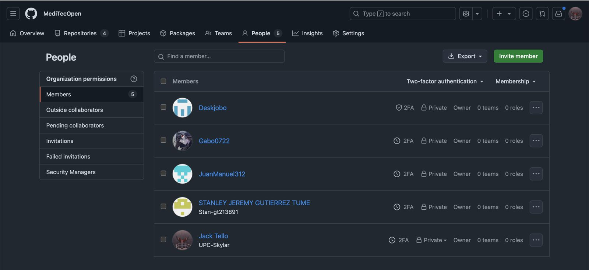
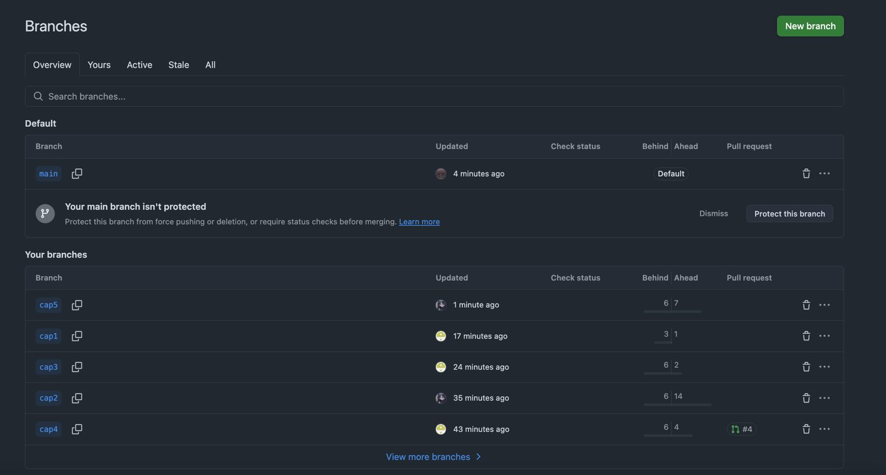
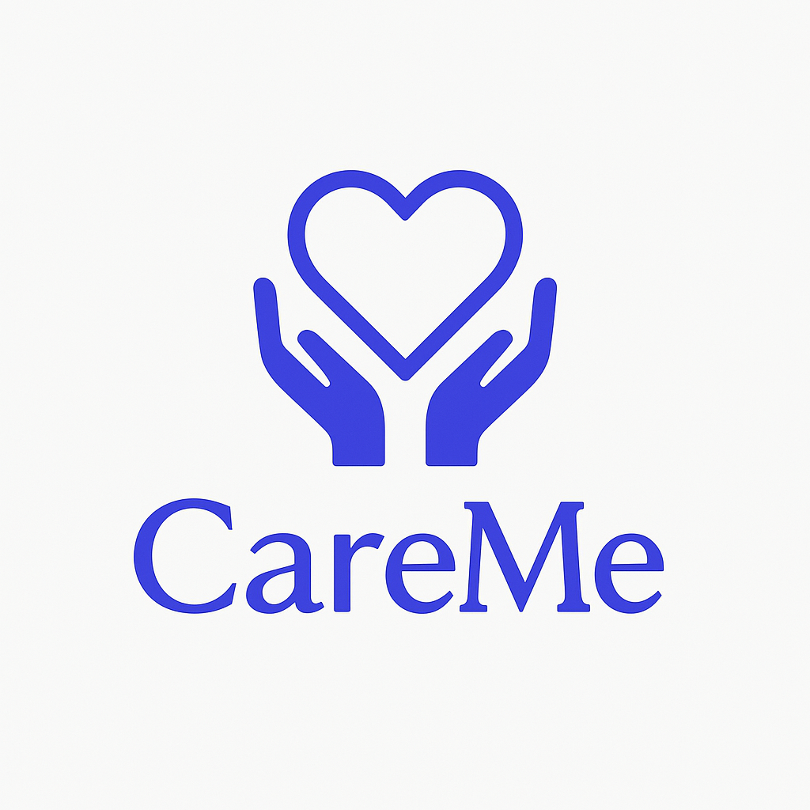
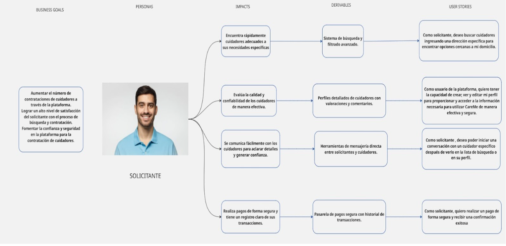
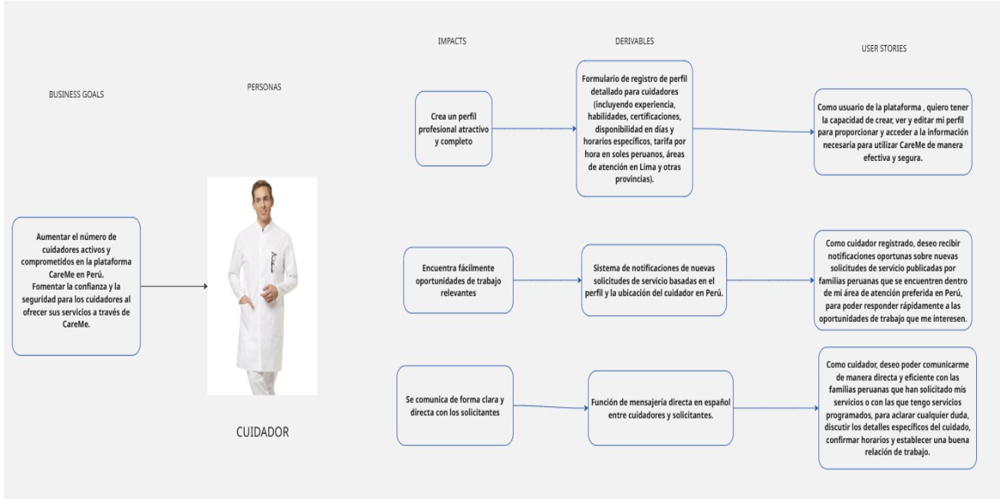
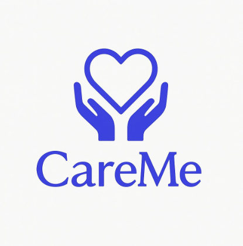

    

<h1 align="center">
    Universidad Peruana de Ciencias Aplicadas
</h1>

<h3 align="center">
    Carrera: Ingeniería de Software
       
    Curso: SI729 - Desarrollo de Aplicaciones Open Source
       
    Sección: 4344
       
    Profesor: Rafael Oswaldo Castro Veramendi
       
    Ciclo: 2025-01 
       
    Informe de Trabajo Final
       
    Startup: MediTech
       
    Producto: CareMe  
</h3>

| 
Alumno
 | 
Código
 |
|:-------------------------------------:|:-------------------------------------:|
|        Roque Tello, Jack Eddie              |              u20221c448               |
|       Bottger Salazar, Johan Karl       |              u202210735               |
|          Lapa de la Cruz, Gabriel Omar          |              u202216831               |
|         Santos Torres, Juan Manuel         |              u20221a371               |
|        Stanley Gutierrez, Tume        |              u202118152               |

 Abril 2025 

## Registro de Versiones del Informe

| Versión | Fecha | 
Autor(es) 
 | 
Descripción de la modificación
 |
|:-------:|:-----:|:-----------------------------------------:|-------------------------------------------------------------|
| TB1 | 25/04/2025 | - Roque Tello, Jack - Bottger Salazar, Johan Karl - Santos Torres, Juan Manuel  | Para esta entrega se han desarrollado los siguientes capítulos:  - Carátula - Registro de Versiones del Informe - Project Report Collaboration Insights - Contenido - Student Outcome - Capítulo I: Introducción - Capítulo II: Requirements Elicitation & Analysis - Capítulo III: Requirements Specification - Capítulo IV: Product Design - Capítulo V: Product Implementation, Validation & Deployment - 5.1. Software Configuration Management - 5.1.1. Software Development Environment Configuration - 5.1.2. Source Code Management - 5.1.3. Source Code Style Guide & Conventions - 5.1.4. Software Deployment Configuration - 5.2. Landing Page, Services & Applications Implementation - 5.2.1. Sprint 1 - 5.2.1.1. Sprint Planning 1 - 5.2.1.2. Aspect Leaders and Collaborators - 5.2.1.3. Sprint Backlog 1 - 5.2.1.4. Development Evidence for Sprint Review - 5.2.1.5. Execution Evidence for Sprint Review - 5.2.1.6. Services Documentation Evidence for Sprint Review - 5.2.1.7. Software Deployment Evidence for Sprint Review - 5.2.1.8. Team Collaboration Insights during Sprint - Avance de Conclusiones, Bibliografía y Anexos |

## Project Report Collaboration Insights  

Nuestro Project Report se encuentra en el siguiente repositorio de GitHub: 

🔗[https://github.com/MediTecOpen/docs/tree/main/docs](https://github.com/MediTecOpen/docs/tree/main).

- **Flujo de trabajo adoptado**

    Durante el desarrollo colaborativo de este repositorio, hemos decidido adoptar el flujo de trabajo GitHub Flow, debido a su simplicidad, escalabilidad y orientación a la integración continua. Este flujo nos ha permitido:

    - Crear ramas individuales por cada integrante y sección asignada.
    - Realizar pull requests para revisión de cambios antes de integrarlos a la rama principal.
    - Discutir observaciones mediante comentarios en los commits o PRs.
    - Asegurar la integración progresiva, ordenada y sin conflictos del contenido en el informe final.

    Además, hemos establecido una convención de nombres para las ramas utilizando el siguiente esquema: cap[numero-capitulo], lo que facilita la identificación de la sección en proceso de edición. Del mismo modo, los mensajes de commit son claros y están formulados siguiendo la semántica de los commits convencionales, lo que mejora la trazabilidad y comprensión del historial de cambios.
  
### Colaboración por Entrega

- **TB1:**
    Para la Primera Entrega (TB1) del Project Report, cada miembro del equipo participó activamente en la redacción de secciones específicas. La coordinación se realizó de forma asincrónica y vía reuniones breves en línea para consensuar estilos de redacción y criterios de inclusión.

    - Asignación de secciones por miembro:
        - Roque Tello, Jack Eddie (UPC-Skylar): Capitulo 1 , Capitulo 2, landing page
        - Todos: Capitulo 5
    A continuación, se adjuntan capturas que evidencian el trabajo distribuido:
    Miembros del equipo en el repositorio:
         
        
    - Creación de ramas por cada capítulo:
          
    - Commits realizados en las ramas individuales:
  

## Tabla de Contenidos

[Registro de Versiones del Informe](#registro-de-versiones-del-informe)

[Project Report Collaboration Insights](#project-report-collaboration-insights)

[Tabla de Contenidos](#tabla-de-contenidos)

[Student Outcome](#student-outcome)

[Capítulo I: Introducción](#capítulo-i-introducción)
  - [1.1. Startup Profile](#11-startup-profile)
    - [1.1.1. Descripción de la Startup](#111-descripción-de-la-startup)
    - [1.1.2. Perfiles de Integrantes del Equipo](#112-perfiles-de-integrantes-del-equipo)
  - [1.2. Solution Profile](#12-solution-profile)
    - [1.2.1. Antecedentes y Problemática](#121-antecedentes-y-problemática)
    - [1.2.2. Lean UX Process](#122-lean-ux-process)
      - [1.2.2.1. Lean UX Problem Statements](#1221-lean-ux-problem-statements)
      - [1.2.2.2. Lean UX Assumptions](#1222-lean-ux-assumptions)
      - [1.2.2.3. Lean UX Hypothesis Statements](#1223-lean-ux-hypothesis-statements)
      - [1.2.2.4. Lean UX Canvas](#1224-lean-ux-canvas)
  - [1.3. Segmentos Objetivos](#13-segmentos-objetivos)

[Capítulo II: Requirements Elicitation & Analysis](#capítulo-ii-requirements-elicitation--analysis)
  - [2.1. Competidores](#21-competidores)
    - [2.1.1. Análisis competitivo](#211-análisis-competitivo)
    - [2.1.2. Estrategias y tácticas frente a competidores](#212-estrategias-y-tácticas-frente-a-competidores)
  - [2.2. Entrevistas](#22-entrevistas)
    - [2.2.1. Diseño de entrevistas](#221-diseño-de-entrevistas)
    - [2.2.2. Registro de entrevistas](#222-registro-de-entrevistas)
    - [2.2.3. Análisis de entrevistas](#223-análisis-de-entrevistas)
  - [2.3. Needfinding](#23-needfinding)
    - [2.3.1. User Personas](#231-user-personas)
    - [2.3.2. User Task Matrix](#232-user-task-matrix)
    - [2.3.3. User Journey Mapping](#233-user-journey-mapping)
    - [2.3.4. Empathy Mapping](#234-empathy-mapping)
        - [2.3.4.1. Empathy Mapping Turistas nacionales e internacionales](#2341-empathy-mapping-turistas-nacionales-e-internacionales)
        - [2.3.4.2. Empathy Mapping Agencias de turismo locales](#2342-empathy-mapping-agencias-de-turismo-locales)
        - [2.3.4.3. Empathy Mapping Viajeros por trabajo](#2343-empathy-mapping-viajeros-por-trabajo)
    - [2.3.5. As-is Scenario Mapping](#235-as-is-scenario-mapping)
        - [2.3.5.1. As-is Scenario Mapping Turistas nacionales e internacionales](#2351-as-is-scenario-mapping-turistas-nacionales-e-internacionales)
        - [2.3.5.2. As-is Scenario Mapping Agencias de turismo locales](#2352-as-is-scenario-mapping-agencias-de-turismo-locales)
        - [2.3.5.3. As-is Scenario Mapping Viajeros por trabajo](#2353-as-is-scenario-mapping-viajeros-por-trabajo)
  - [2.4. Ubiquitous Language](#24-ubiquitous-language)

[Capítulo III: Requirements Specification](#capítulo-iii-requirements-specification)
  - [3.1. To-Be Scenario Mapping](#31-to-be-scenario-mapping)
    - [3.1.1. To-Be Scenario Mapping Personas que necesitan Cuidado para un familiar por horas](#311-to-Be-scenario-personas-que-necesitan-cuidado)
    - [3.1.2. To-Be Scenario Mapping Cuidadores Profesionales](#312-to-Be-scenario-mapping-cuidadores-profesionales)

#### 3.1.2. To-Be Scenario Mapping Cuidadores Profesionales
  - [3.2. User Stories](#32-user-stories)
  - [3.3. Impact Mapping](#33-impact-mapping)
  - [3.4. Product Backlog](#34-product-backlog)

[Capítulo IV: Product Design](#capítulo-iv-product-design)
  - [4.1. Style Guidelines](#41-style-guidelines)
    - [4.1.1. General Style Guidelines](#411-general-style-guidelines)
    - [4.1.2. Web Style Guidelines](#412-web-style-guidelines)
  - [4.2. Information Architecture](#42-information-architecture)
    - [4.2.1. Organization Systems](#421-organization-systems)
    - [4.2.2. Labeling Systems](#422-labeling-systems)
    - [4.2.3. SEO Tags and Meta Tags](#423-seo-tags-and-meta-tags)
    - [4.2.4. Searching Systems](#424-searching-systems)
    - [4.2.5. Navigation Systems](#425-navigation-systems)
  - [4.3. Landing Page UI Design](#43-landing-page-ui-design)
    - [4.3.1. Landing Page Wireframe](#431-landing-page-wireframe)
    - [4.3.2. Landing Page Mock-up](#432-landing-page-mock-up)
  - [4.4. Web Applications UX/UI Design](#44-web-applications-uxui-design)
    - [4.4.1. Web Applications Wireframes](#441-web-applications-wireframes)
    - [4.4.2. Web Applications Wireflow Diagrams](#442-web-applications-wireflow-diagrams)
    - [4.4.3. Web Applications Mock-ups](#443-web-applications-mock-ups)
    - [4.4.4. Web Applications User Flow Diagrams](#444-web-applications-user-flow-diagrams)
  - [4.5. Web Applications Prototyping](#45-web-applications-prototyping)
  - [4.6. Domain-Driven Software Architecture](#46-domain-driven-software-architecture)
    - [4.6.1. Software Architecture Context Diagrams](#461-software-architecture-context-diagrams)
    - [4.6.2. Software Architecture Container Diagrams](#462-software-architecture-container-diagrams)
    - [4.6.3. Software Architecture Components Diagrams](#463-software-architecture-components-diagrams)
  - [4.7. Software Object-Oriented Design](#47-software-object-oriented-design)
    - [4.7.1. Class Diagrams](#471-class-diagrams)
    - [4.7.2. Class Dictionary](#472-class-dictionary)
  - [4.8. Database Design](#48-database-design)
    - [4.8.1. Database Diagram](#481-database-diagram)

[Capítulo V: Product Implementation, Validation & Deployment](#capítulo-v-product-implementation-validation--deployment)
  - [5.1. Software Configuration Management](#51-software-configuration-management)
    - [5.1.1. Software Development Environment Configuration](#511-software-development-environment-configuration)
    - [5.1.2. Source Code Management](#512-source-code-management)
    - [5.1.3. Source Code Style Guide & Conventions](#513-source-code-style-guide-conventions)
    - [5.1.4. Software Deployment Configuration](#514-software-deployment-configuration)
  - [5.2. Landing Page, Services & Applications Implementation](#52-landing-page-services--applications-implementation)
    - [5.2.1. Sprint 1](#521-sprint-1)
      - [5.2.1.1. Sprint Planning 1](#5211-sprint-planning-1)
      - [5.2.1.2. Aspect Leaders and Collaborators](#5212-aspect-leaders-and-collaborators)
      - [5.2.1.3. Sprint Backlog 1](#5213-sprint-backlog-1)
      - [5.2.1.4. Development Evidence for Sprint Review](#5214-development-evidence-for-sprint-review)
      - [5.2.1.5. Execution Evidence for Sprint Review](#5215-execution-evidence-for-sprint-review)
      - [5.2.1.6. Services Documentation Evidence for Sprint Review](#5216-services-documentation-evidence-for-sprint-review)
      - [5.2.1.7. Software Deployment Evidence for Sprint Review](#5217-software-deployment-evidence-for-sprint-review)
      - [5.2.1.8. Team Collaboration Insights during Sprint](#5218-team-collaboration-insights-during-sprint)

[Conclusiones](#conclusiones)

[Bibliografía](#bibliografía)

[Anexos](#anexos)

## Student Outcome

El curso contribuye al cumplimiento del Student Outcome ABET:

**ABET – EAC - Student Outcome 3**

Criterio: Capacidad de comunicarse efectivamente con un rango de audiencias. 
En el siguiente cuadro se describe las acciones realizadas y enunciados de conclusiones por parte del grupo,
que permiten sustentar el haber alcanzado el logro del ABET – EAC - Student Outcome 3.

| 
Criterio específico
 | 
Acciones Realizadas
 | 
Conclusiones
 |
|:-------------------:|-------------------|------------|
|Comunica oralmente con efectividad a diferentes rangos de audiencia| **- Jack Tello**   **TB1:** En esta entrega me encargué de comunicarle a mi equipo cuál sería la metodología de trabajo. Además, participé activamente en la revisión retroactiva de los avances de mis compañeros. También apoyé en la preparación del material de presentación para nuestras reuniones internas.  **TP:**   **TB2:**   **TF:**   | **TB1:** Consideramos que para las proximas entregas debemos mantener una comunicación activa y eficaz que fortalezca la confianza, y por ende, el trabajo en equipo, un valor crucial para proyectos colaborativos.|
|Comunica por escrito con efectividad a diferentes rangos de audiencia| **- Jack Tello**   **TB1** Colabore con la elaboración de las pautas y alineamientos que nuestro equipo seguiría durante el proceso de desarrollo de software. Asimismo, me encargue de elaborar el Capitulo 1 y 2.   **TP:**   **TB2:**   **TF:**    

## Capítulo I: Introducción 

### 1.1. Startup Profile

#### 1.1.1. Descripción de la Startup

EcoVolt es una solución tecnológica web desarrollada en el Perú que permite a las empresas monitorear, analizar y optimizar su consumo eléctrico mediante el uso de dispositivos IoT inteligentes. Nuestra plataforma web integra tecnología de vanguardia con un enfoque centrado en la eficiencia energética, ofreciendo a las organizaciones herramientas prácticas para reducir sus costos operativos, cumplir con normativas ambientales y tomar decisiones sostenibles basadas en datos.
EcoVolt actúa como puente entre dos actores clave: las empresas con necesidades energéticas crecientes y los profesionales eléctricos encargados de instalar, calibrar y mantener los dispositivos. Mientras las empresas obtienen visualización en tiempo real, alertas inteligentes y reportes exportables, los técnicos cuentan con un modo especializado para gestionar instalaciones, diagnósticos y configuraciones de forma profesional.
En un contexto donde el consumo energético eficiente no solo representa un ahorro económico, sino también una responsabilidad ambiental, EcoVolt se presenta como un aliado estratégico para impulsar una cultura de sostenibilidad apoyada en tecnología accesible, confiable y escalable.

**Misión**
Nuestra misión es transformar la manera en que las empresas gestionan su consumo eléctrico, proporcionando una plataforma inteligente, confiable y adaptable que integre dispositivos IoT con análisis energético en tiempo real. Buscamos generar valor mediante la eficiencia, conectando a organizaciones con profesionales eléctricos especializados y promoviendo un uso más consciente y responsable de los recursos energéticos.

**Visión**
Aspiramos a consolidarnos como la solución líder en monitoreo y optimización energética en el Perú, impactando positivamente en la competitividad de las empresas y en el trabajo de los técnicos eléctricos. Nuestro objetivo es contribuir a un ecosistema empresarial más eficiente y sostenible, con la proyección de expandirnos gradualmente hacia otros países de Latinoamérica, impulsando desde nuestra tecnología desarrollada en Perú una nueva forma de gestionar la energía en la región.

**Logo**

#### 1.1.2. Perfiles de Integrantes del Equipo

#### 1.2. Solution Profile

En nuestro país, muchas familias tienen a su cargo personas mayores con discapacidad o en situación de dependencia temporal, y enfrentan dificultades al buscar cuidadores confiables y calificados por horas. Esta situación es cada vez más común debido al envejecimiento poblacional, los ritmos laborales actuales y la limitada disponibilidad de redes de apoyo confiables. En este sentido, se vuelve imprescindible contar con una plataforma que facilite el acceso a servicios de cuidado de forma segura, rápida y personalizada.
Por ello, proponemos CareMe, una aplicación web que funcionará como intermediaria para conectar a personas que necesitan servicios de cuidado por horas con cuidadores profesionales o técnicos de carreras de salud debidamente validados. El objetivo es brindar tranquilidad y eficiencia en la contratación de servicios de cuidado domiciliario por horas.
Para hacer uso de la app, los usuarios deberán:
Crear un perfil según su rol (cuidador o contratante)

Podrán elegir entre un apartado de cuidadores disponibles según ubicación, disponibilidad, especialización, experiencia y valoraciones

La app se encargará de intermediar para que el usuario pueda comunicarse, agendar y contratar servicios directamente con el cuidador seleccionado
Para el funcionamiento de nuestra aplicación se realizarán alianzas con universidades, institutos de salud, cuidadores independientes y centros médicos. Es así que los ingresos de la empresa serán percibidos por una cuota mensual y por comisión sobre los servicios contratados dentro de la plataforma. Sin embargo, dicha modalidad de monetización aún está en proceso de validación, ya que se necesita establecer los ingresos y gastos que se generarían al salir al mercado como empresa formal.

#### 1.2.1. Antecedentes y problemática

#### 1.2.2. Lean UX Process

#### 1.2.2.1. Lean UX Problem Statements

#### 1.2.2.2. Lean UX Assumptions

#### 1.2.2.3. Lean UX Hypothesis Statements

#### 1.2.2.4. Lean UX Canvas

### 1.3. Segmentos Objetivos

## Capítulo II: Requirements Elicitation & Analysis

### 2.1. Competidores

#### 2.1.1. Análisis competitivo

#### 2.1.2. Estrategias y tácticas frente a competidores

### 2.2. Entrevistas

#### 2.2.1. Diseño de entrevistas

#### 2.2.2. Registro de entrevistas

#### 2.2.3. Análisis de entrevistas

### 2.3. Needfinding

#### 2.3.1. User Personas

#### 2.3.2. User Task Matrix

#### 2.3.3. User Journey Mapping

#### 2.3.4. Empathy Mapping

#### 2.3.4.1. Empathy Mapping Turistas nacionales e internacionales

#### 2.3.4.2. Empathy Mapping Agencias de turismo locales

#### 2.3.4.3. Empathy Mapping Viajeros por trabajo

#### 2.3.5. As-is Scenario Mapping

#### 2.3.5.1. As-is Scenario Mapping Turistas nacionales e internacionales

#### 2.3.5.2. As-is Scenario Mapping Agencias de turismo locales

#### 2.3.5.3. As-is Scenario Mapping Viajeros por trabajo

### 2.4. Ubiquitous Language

## Capítulo III: Requirements Specification

### 3.1. To-Be Scenario Mapping

#### 3.1.1. To-Be Scenario Mapping Personas que necesitan Cuidado para un familiar por Horas

#### 3.1.2. To-Be Scenario Mapping Cuidadores Profesionales

### 3.2. User Stories

| EPIC/STORY ID | TÍTULO                                              | Descripción                                                                                                                                                 | Criterios de Aceptación                                                                                                                                                                                                                                                                                                                       | Relacionado con (Epic ID) |
|---------------|------------------------------------------------------|-------------------------------------------------------------------------------------------------------------------------------------------------------------|--------------------------------------------------------------------------------------------------------------------------------------------------------------------------------------------------------------------------------------------------------------------------------------------------------------------------------------------------|----------------------------|
| EPIC 1        | Búsqueda de Cuidadores                              | Como usuario, quiero poder buscar cuidadores por ubicación, disponibilidad y tipo de servicio.                                                              | DADO QUE estoy en la página de búsqueda, CUANDO ingreso criterios como ubicación y tipo de servicio, ENTONCES se mostrarán cuidadores disponibles que coincidan con los criterios.                                                                                                                                                             |                            |
| HU01          | Buscar cuidadores por ubicación                     | Como usuario, quiero ingresar mi ubicación para ver cuidadores cercanos.                                                                                    | DADO QUE ingreso mi ubicación, CUANDO haga clic en "Buscar", ENTONCES veré una lista de cuidadores disponibles cerca de mí.                                                                                                                                                                                                                     | EPIC 1                    |
| HU02          | Filtrar cuidadores por disponibilidad               | Como usuario, quiero aplicar filtros de disponibilidad para encontrar cuidadores libres en el horario que necesito.                                        | DADO QUE estoy en la página de búsqueda, CUANDO seleccione un rango horario, ENTONCES veré cuidadores que tienen disponibilidad en ese horario.                                                                                                                                                                                               | EPIC 1                    |
| HU03          | Filtrar cuidadores por tipo de servicio             | Como usuario, quiero filtrar cuidadores por tipo de servicio para ver solo los que ofrecen lo que necesito.                                                | DADO QUE elijo un tipo de servicio (e.g. cuidado de niños), CUANDO aplique el filtro, ENTONCES la lista mostrará cuidadores que ofrecen ese servicio.                                                                                                                                                                                           | EPIC 1                    |
| HU04          | Ver resultados de búsqueda                          | Como usuario, quiero ver una lista clara de resultados con cuidadores, su calificación y disponibilidad.                                                  | DADO QUE se realiza una búsqueda, CUANDO se muestran los resultados, ENTONCES cada cuidador debe tener una tarjeta con nombre, foto, calificación y botón de ver perfil.                                                                                                                                                                      | EPIC 1                    |
| EPIC 2        | Gestión de Perfiles                                 | Como usuario, quiero gestionar mi perfil personal o de cuidador para mantener mi información actualizada.                                                  | DADO QUE tengo una cuenta, CUANDO accedo a "Mi perfil", ENTONCES podré editar mi información personal y profesional según el tipo de usuario.                                                                                                                                                                                                 |                            |
| HU05          | Editar información personal                         | Como usuario, quiero editar mis datos personales como nombre, teléfono y dirección.                                                                       | DADO QUE estoy en mi perfil, CUANDO hago clic en "Editar", ENTONCES podré modificar mis datos personales y guardar los cambios.                                                                                                                                                                                                               | EPIC 2                    |
| HU06          | Agregar experiencia como cuidador                   | Como cuidador, quiero agregar mi experiencia laboral para que los clientes vean mi trayectoria.                                                           | DADO QUE soy cuidador, CUANDO edito mi perfil, ENTONCES podré agregar entradas con años de experiencia, roles anteriores y certificaciones.                                                                                                                                                                                                   | EPIC 2                    |
| HU07          | Subir foto de perfil                                | Como usuario, quiero subir una foto para que otros me reconozcan en la plataforma.                                                                         | DADO QUE estoy editando mi perfil, CUANDO suba una imagen, ENTONCES se mostrará en mi perfil después de guardar.                                                                                                                                                                                                                               | EPIC 2                    |
| HU08          | Configurar visibilidad del perfil                   | Como cuidador, quiero decidir si mi perfil es visible o no para los clientes.                                                                              | DADO QUE estoy editando mi perfil, CUANDO active o desactive la visibilidad, ENTONCES mi perfil será mostrado u ocultado en la búsqueda.                                                                                                                                                                                                      | EPIC 2                    |
| EPIC 3        | Agendamiento de Servicios                           | Como cliente, quiero agendar servicios con un cuidador en un día y horario específico.                                                                     | DADO QUE elijo un cuidador, CUANDO selecciono una fecha y hora, ENTONCES podré enviar una solicitud de servicio.                                                                                                                                                                                                                              |                            |
| HU09          | Solicitar servicio a un cuidador                    | Como cliente, quiero enviar una solicitud a un cuidador con detalles del servicio.                                                                         | DADO QUE estoy en el perfil de un cuidador, CUANDO hago clic en "Agendar", ENTONCES podré ingresar fecha, hora y descripción del servicio.                                                                                                                                                                                                    | EPIC 3                    |
| HU10          | Ver solicitudes pendientes                          | Como cuidador, quiero ver todas las solicitudes de clientes pendientes de respuesta.                                                                       | DADO QUE soy cuidador, CUANDO accedo a la sección de solicitudes, ENTONCES veré las nuevas solicitudes con la opción de aceptar o rechazar.                                                                                                                                                                                                   | EPIC 3                    |
| HU11          | Confirmar o rechazar servicio                       | Como cuidador, quiero aceptar o rechazar solicitudes según mi disponibilidad.                                                                             | DADO QUE recibo una solicitud, CUANDO la revise, ENTONCES podré aceptarla o rechazarla y el cliente será notificado.                                                                                                                                                                                                                          | EPIC 3                    |
| HU12          | Ver servicios agendados                             | Como usuario, quiero ver un calendario con los servicios confirmados.                                                                                      | DADO QUE tengo servicios confirmados, CUANDO acceda a "Mi agenda", ENTONCES veré los servicios en formato de calendario.                                                                                                                                                                                                                       | EPIC 3                    |
| EPIC 4        | Comunicación entre Usuarios                         | Como usuario, quiero poder comunicarme con cuidadores o clientes para coordinar servicios.                                                                 | DADO QUE tengo un servicio pendiente o confirmado, CUANDO entre a la conversación, ENTONCES podré intercambiar mensajes.                                                                                                                                                                                                                      |                            |
| HU13          | Iniciar conversación con cuidador/cliente           | Como usuario, quiero poder enviar mensajes al otro usuario tras una solicitud enviada o aceptada.                                                          | DADO QUE tengo una solicitud activa, CUANDO accedo al perfil del otro usuario, ENTONCES veré un botón para iniciar chat.                                                                                                                                                                                                                       | EPIC 4                    |
| HU14          | Enviar y recibir mensajes                           | Como usuario, quiero tener un chat simple para coordinar detalles con el otro usuario.                                                                    | DADO QUE la conversación está iniciada, CUANDO envío un mensaje, ENTONCES el otro usuario lo verá en tiempo real (o casi).                                                                                                                                                                                                                    | EPIC 4                    |
| HU15          | Ver historial de conversaciones                     | Como usuario, quiero ver el historial de mis conversaciones anteriores.                                                                                    | DADO QUE tengo mensajes antiguos, CUANDO accedo a la sección de mensajería, ENTONCES podré revisar chats pasados.                                                                                                                                                                                                                             | EPIC 4                    |
| EPIC 5        | Gestión de Pagos                                    | Como cliente, quiero pagar por los servicios contratados de forma segura y como cuidador recibir el pago.                                                  | DADO QUE un servicio está confirmado y completado, CUANDO lo marque como finalizado, ENTONCES se realizará el pago correspondiente al cuidador.                                                                                                                                                                                               |                            |
| HU16          | Registrar método de pago                            | Como cliente, quiero ingresar una tarjeta de crédito o débito para pagar los servicios.                                                                   | DADO QUE soy cliente, CUANDO acceda a la sección de pagos, ENTONCES podré registrar o eliminar mis tarjetas.                                                                                                                                                                                                                                  | EPIC 5                    |
| HU17          | Visualizar historial de pagos                       | Como usuario, quiero ver todas las transacciones realizadas por servicios contratados.                                                                    | DADO QUE he contratado servicios, CUANDO entre a "Mis pagos", ENTONCES veré una lista con fechas, montos y cuidadores relacionados.                                                                                                                                                                                                           | EPIC 5                    |
| HU18          | Recibir pagos como cuidador                         | Como cuidador, quiero recibir el dinero de los servicios realizados en mi cuenta.                                                                         | DADO QUE un servicio fue completado, CUANDO el cliente confirme el fin del servicio, ENTONCES el sistema enviará el pago a mi cuenta.                                                                                                                                                                                                         | EPIC 5                    |
| EPIC 6        | Soporte y Ayuda                                     | Como usuario, quiero tener acceso a ayuda, preguntas frecuentes y contacto con soporte técnico.                                                            | DADO QUE tengo una duda o problema, CUANDO acceda a la sección de ayuda, ENTONCES veré recursos para resolver mis inquietudes o contactar al equipo de soporte.                                                                                                                                                                                 |                            |
| HU19          | Acceder a preguntas frecuentes                      | Como usuario, quiero acceder a FAQ para encontrar respuestas rápidas.                                                                                      | DADO QUE estoy en la plataforma, CUANDO accedo a "FAQ", ENTONCES veré una lista organizada con preguntas y respuestas relevantes.                                                                                                                                                                                                            | EPIC 6                    |
| HU20          | Buscar en la sección de ayuda                       | Como usuario, quiero buscar dentro de la sección de ayuda usando palabras clave.                                                                          | DADO QUE estoy en "Ayuda", CUANDO introduzco palabras clave, ENTONCES veré artículos, FAQ o guías relevantes.                                                                                                                                                                                                                                 | EPIC 6                    |
| HU21          | Contactar con soporte por correo                    | Como usuario, quiero contactar al soporte vía correo electrónico para consultas más complejas.                                                             | DADO QUE accedo a la sección de soporte, CUANDO haga clic en "Correo electrónico", ENTONCES podré enviar preguntas y recibir respuestas.                                                                                                                                                                                                     | EPIC 6                    |

### 3.3. Impact Mapping

En esta sección se describen y muestran los Impact Mappings, los cuales fueron desarrollados a partir de los User Personas. Estos mapas incluyen los objetivos de negocio de cada uno y permiten identificar las funcionalidades necesarias para generar los entregables definidos.

Segmento solicitante

Segmento cuidador

### 3.4. Product Backlog

| #ORDEN | USER STORY ID | TÍTULO                                             | DESCRIPCIÓN                                                                                                                                                       | STORY POINTS |
|--------|----------------|----------------------------------------------------|--------------------------------------------------------------------------------------------------------------------------------------------------------------------|---------------|
| 1      | HU01-EP01       | Buscar cuidadores ingresando dirección            | Como solicitante, deseo buscar cuidadores ingresando una dirección específica para encontrar opciones cercanas a mi domicilio.                                   | 3             |
| 2      | HU02-EP01       | Ajustar radio de búsqueda                         | Como solicitante, deseo poder ajustar el radio de búsqueda para ampliar o reducir el área de cobertura.                                                          | 2             |
| 3      | HU03-EP01       | Mostrar estado de actividad del cuidador         | Como solicitante, deseo ver claramente si un cuidador está actualmente activo o no en la plataforma.                                                             | 1             |
| 4      | HU04-EP01       | Buscar cuidadores usando mi ubicación actual     | Como solicitante, deseo buscar cuidadores utilizando la ubicación actual de mi dispositivo para encontrar opciones cercanas a donde me encuentro.               | 3             |
| 5      | HU01-EP02       | Acceder a la página de registro de solicitante   | Como nuevo usuario, deseo acceder a una página específica para registrarme como solicitante.                                                                     | 1             |
| 6      | HU02-EP02       | Registrarse como solicitante                     | Como nuevo usuario, deseo registrarme como solicitante proporcionando mi nombre, correo electrónico y número de teléfono, y estableciendo una contraseña.        | 5             |
| 7      | HU03-EP02       | Ver mi perfil                                     | Como solicitante registrado, deseo poder acceder a la sección de mi perfil para revisar la información que he proporcionado.                                     | 2             |
| 8      | HU01-EP03       | Cancelar un servicio programado                  | Como solicitante, deseo poder cancelar un servicio de cuidado programado en caso de necesidad, siguiendo las políticas de cancelación.                          | 3             |
| 9      | HU02-EP03       | Ver el historial de servicios completados        | Como solicitante, deseo poder ver un registro de los servicios de cuidado que ya se han completado.                                                              | 2             |
| 10     | HU03-EP03       | Confirmar asistencia a un servicio programado    | Como cuidador, deseo poder confirmar mi asistencia a un servicio de cuidado programado antes de la fecha y hora de inicio.                                       | 2             |
| 11     | HU04-EP03       | Marcar un servicio como completado              | Como cuidador, deseo poder marcar un servicio de cuidado como completado una vez que lo haya finalizado.                                                         | 2             |
| 12     | HU01-EP04       | Iniciar conversación                              | Como solicitante o cuidador, deseo poder iniciar una conversación con un cuidador específico después de verlo en la lista de búsqueda o en su perfil.           | 5             |
| 13     | HU02-EP04       | Recibir notificación de nuevo mensaje            | Como solicitante, deseo recibir una notificación clara cuando un cuidador me envíe un nuevo mensaje para poder responder rápidamente.                            | 3             |
| 14     | HU01-EP05       | Gestión de Pagos y Transacciones                | Como solicitante, quiero ver las opciones de pago disponibles antes de confirmar un servicio. Como cuidador, quiero ver las opciones de retiro de fondos disponibles en mi configuración de pagos. | 2             |
| 15     | HU02-EP05       | Realizar pago y recibir confirmación             | Como solicitante, quiero realizar un pago de forma segura y recibir una confirmación exitosa.                                                                    | 5             |
| 16     | HU03-EP05       | Recibir pago por servicio completado             | Como cuidador, quiero recibir el pago por los servicios que he completado de forma segura a través de la plataforma.                                             | 3             |
| 17     | HU04-EP05       | Configurar método de retiro                      | Como cuidador, quiero configurar mi método de retiro y solicitar la transferencia de mis fondos disponibles.                                                     | 5             |
| 18     | HU01-EP06       | Acceder a preguntas frecuentes                   | Como usuario (solicitante o cuidador), quiero acceder a una lista de preguntas frecuentes para encontrar respuestas rápidas a mis dudas más comunes.            | 1             |
| 19     | HU02-EP06       | Buscar en la sección de ayuda                   | Como usuario (solicitante o cuidador), quiero poder buscar información específica dentro de la sección de ayuda utilizando palabras clave.                      | 3             |
| 20     | HU03-EP06       | Contactar con el soporte por chat en vivo        | Como usuario (solicitante o cuidador), quiero poder contactar con un agente de soporte a través de chat en vivo para obtener asistencia inmediata.              | 8             |
| 21     | HU04-EP06       | Contactar con el soporte por correo electrónico  | Como usuario (solicitante o cuidador), quiero poder contactar con el soporte a través de correo electrónico para enviar preguntas o problemas más complejos.     | 2             |

## Capítulo IV: Product Design

### 4.1. Style Guidelines
Un Style Guideline constituye un conjunto de normas y directrices destinadas a estandarizar la redacción, el diseño y la presentación de documentos, contenidos digitales, desarrollos de software u otros productos creativos. A continuación, se detallan las especificaciones correspondientes a los parámetros adoptados en la estructura del proyecto.

#### 4.1.1. General Style Guidelines

Brand Overview
CareMe es una plataforma digital innovadora que conecta a familias con cuidadores profesionales certificados. Su diseño visual busca transmitir confianza, profesionalismo y calidez, pilares fundamentales en la atención domiciliaria de adultos mayores.

Brand Name
El nombre "CareMe" combina el concepto de cuidado (“Care”) con el pronombre “Me” para enfatizar la atención personalizada y humana que brinda la plataforma. Reforzamos la empatía y el trato digno a través del nombre y su identidad visual.

Logo

Typography
 Para mantener una experiencia accesible y amigable, se usarán tipografías modernas y legibles como:
Headings: Montserrat Bold

Body text: Open Sans Regular

Buttons: Open Sans Semibold

Links: Open Sans Italic
Colors
Color
Código HEX
Significado
Azul Profesional
#1A73E8
Confianza, tecnología, seguridad
Verde Cálido
#4CAF50
Cuidado, bienestar, empatía
Blanco
#FFFFFF
Claridad, limpieza, accesibilidad
Gris Neutro
#E0E0E0
Neutralidad, profesionalismo
Negro
#212121
Seriedad, lectura clara

#### 4.1.2. Web Style Guidelines

La plataforma será completamente responsive, adaptándose a móviles, tablets y escritorios. Se seguirá el patrón de lectura en Z para guiar la mirada del usuario desde el logo, pasando por el menú y terminando en los llamados a la acción.
El diseño prioriza una experiencia accesible, con contraste visual suficiente, botones grandes y etiquetas claras. El estilo también comunicará calidez y profesionalismo, elementos clave para este tipo de servicio.

### 4.2. Information Architecture

En esta sección se describe cómo se estructura la información dentro de la plataforma CareMe, considerando la experiencia tanto en la Landing Page como en la Aplicación Web para contratantes y cuidadores. El objetivo es asegurar una navegación fluida, comprensible y eficiente, maximizando la usabilidad y minimizando el esfuerzo cognitivo del usuario.
La arquitectura se apoya en principios de organización jerárquica, sistemas de etiquetado claros, mecanismos de búsqueda efectivos y patrones de navegación intuitivos, diseñados para atender a dos perfiles principales: Contratante (familiares que buscan cuidados por horas) y Cuidador (profesionales de la salud certificados).

#### 4.2.1. Organization Systems
Tipo de organización usada:
 Se ha optado por una estructura jerárquica combinada con organización por tareas y roles, lo cual facilita que cada tipo de usuario (contratante o cuidador) pueda encontrar fácilmente la funcionalidad que necesita según su objetivo y etapa dentro del proceso (registro, búsqueda, agendamiento, comunicación, pagos, etc.).
Organización de la Landing Page:
Encabezado (Header): Logo, menú principal (Inicio, Servicios, Cómo Funciona, Preguntas Frecuentes, Contacto) y botones de acción (Iniciar Sesión / Registrarse).

Sección Introductoria (Hero): Mensaje de valor claro ("Conecta con cuidadores de confianza desde casa"), imagen empática (persona mayor + cuidador), botón CTA principal (“Buscar cuidadores”).

Beneficios: Lista ilustrada de beneficios (“Atención validada”, “Pagos seguros”, “Cuidadores certificados”).

Cómo Funciona: Explicación paso a paso (Buscar → Agendar → Confirmar → Valorar).

Testimonios / Opiniones: Opiniones reales de familias usuarias de la plataforma.

Pie de Página (Footer): Enlaces legales, datos de contacto, redes sociales, derechos de autor.

Organización de la Aplicación Web (por rol)
Contratante
Inicio: Vista general con acceso rápido a cuidadores destacados, próximos servicios agendados, y mensajes recientes.

Buscar cuidadores: Filtros por especialidad, horario, zona, experiencia.

Mi Perfil: Editar datos, métodos de pago, preferencias.

Mis Servicios: Ver servicios pasados, activos y futuros.

Mensajes: Bandeja de conversación con cuidadores.

Centro de Ayuda: FAQs, contacto con soporte.

Cuidador
Inicio: Resumen de próximos servicios, notificaciones nuevas.

Solicitudes recibidas: Panel para aceptar o rechazar servicios.

Mi Perfil Profesional: Descripción, certificaciones, disponibilidad.

Historial: Servicios completados y valoraciones recibidas.

Configuración de pagos: Métodos de retiro, historial de ingresos.

Soporte: Chat en vivo o por correo, preguntas frecuentes.

#### 4.2.2. Labeling Systems
Los sistemas de etiquetado usados en CareMe tienen como objetivo lograr una interfaz clara, coherente y accesible para usuarios de todas las edades, en especial personas adultas que podrían tener menor familiaridad con herramientas digitales.
Tipos de etiquetas utilizadas:
1. Etiquetas Textuales (Text Labels):
Acción directa y sencilla: Usamos verbos claros y en imperativo, como: “Buscar cuidador”, “Agendar servicio”, “Confirmar asistencia”, “Ver historial”.

Consistencia en las vistas: Las secciones principales conservan la misma nomenclatura en el menú, breadcrumbs y botones.

Ejemplos:

“Mis Servicios”

“Mi Perfil”

“Solicitudes Recibidas”

“Confirmar Asistencia”

“Historial de Servicios”

“Configuración de pagos”

2. Etiquetas de Encabezado (Headings):
Se utilizan para estructurar jerárquicamente el contenido dentro de cada vista:

H1: Título de la vista principal (ej. "Buscar Cuidadores")

H2: Subsecciones o acciones importantes (ej. "Filtros", "Resultados de búsqueda")

H3-H4: Etiquetas menores dentro de tarjetas, formularios, etc.

3. Etiquetas Icónicas (Iconic Labels):
Incorporamos íconos simples y reconocibles junto al texto o de forma independiente para:

🔍 Buscar

🏠 Inicio

👤 Usuario

💬 Chat

📅 Calendario

💳 Pagos

4. Etiquetas Contextuales / Tooltips:
Se mostrarán mensajes flotantes al pasar el cursor sobre íconos o botones complejos (ej. “Ver más detalles del cuidador”, “Método de pago no configurado”).

#### 4.2.3. SEO Tags and Meta Tags

La optimización para motores de búsqueda es fundamental para posicionar CareMe como una plataforma de confianza y relevante en el sector de salud y servicios domiciliarios. Usaremos etiquetas SEO básicas y meta tags para asegurar una correcta indexación y visualización en los resultados de búsqueda.

<!-- Título de la plataforma -->
<title>CareMe - Cuidadores certificados a domicilio</title>

<!-- Descripción corta para buscadores -->
<meta name="description" content="CareMe es la plataforma digital que conecta a familias con cuidadores profesionales certificados en Perú. Servicios confiables, seguros y personalizados.">

<!-- Keywords principales -->
<meta name="keywords" content="cuidadores a domicilio, atención adultos mayores, servicios por horas, salud, cuidado, enfermería, cuidado postoperatorio, Lima, Perú">

<!-- Configuración responsive -->
<meta name="viewport" content="width=device-width, initial-scale=1.0">

<!-- Autoría y derechos -->
<meta name="author" content="MediTech - CareMe">
<meta name="copyright" content="© 2024 MediTech. Todos los derechos reservados">

#### 4.2.4. Searching Systems
El sistema de búsqueda de CareMe es uno de los ejes centrales de la experiencia del usuario contratante. Se han diseñado múltiples formas para facilitar el descubrimiento de cuidadores de manera rápida, intuitiva y efectiva:
1. Búsqueda por dirección o zona
Campo de texto donde el usuario puede ingresar la dirección (ej. "Av. Javier Prado 456") o el distrito (ej. "San Borja").

El sistema sugiere zonas conforme se escribe (autocompletado).

Los resultados se muestran en orden de cercanía geográfica.

2. Búsqueda por ubicación actual (geolocalización)
Permite al usuario utilizar su ubicación en tiempo real para encontrar cuidadores cercanos.

Ideal para quienes necesitan atención urgente o inmediata en su entorno.

3. Filtros avanzados
Por tipo de servicio: Cuidado postoperatorio, acompañamiento, alimentación, baño.

Por experiencia profesional: años de experiencia, tipo de certificación.

Por disponibilidad horaria: turnos mañana, tarde o noche.

Por género del cuidador (opcional).

Por valoraciones de otros usuarios (ranking de estrellas).

4. Mapa interactivo (map view)
Integración con APIs de mapas (Google Maps u OpenStreetMap).

Visualización de la ubicación de cada cuidador con pines interactivos.

Al hacer clic sobre un pin, se abre una tarjeta con perfil resumido, disponibilidad y botón para agendar.

5. Búsqueda por nombre de cuidador (si el usuario ya tiene a alguien en mente)
Campo de búsqueda por nombre/apellido.

Útil para usuarios recurrentes o recomendaciones externas.

#### 4.2.5. Navigation Systems
Menú fijo con navegación vertical u horizontal según el dispositivo. Las vistas cambiarán según el rol del usuario (Contratante o Cuidador). La experiencia será intuitiva, con flujos naturales desde el registro hasta la contratación.

### 4.3. Landing Page UI Design

#### 4.3.1. Landing Page Wireframe

#### 4.3.2. Landing Page Mock-up

### 4.4. Web Applications UX/UI Design

#### 4.4.1. Web Applications Wireframes.

#### 4.4.2. Web Applications Wireflow Diagrams

#### 4.4.3. Web Applications Mock-ups

#### 4.4.4. Web Applications User Flow Diagrams

### 4.5. Web Applications Prototyping

### 4.6. Domain-Driven Software Architecture

#### 4.6.1. Software Architecture Context Diagrams

#### 4.6.2. Software Architecture Container Diagrams

#### 4.6.3. Software Architecture Components Diagrams

### 4.7. Software Object-Oriented Design

#### 4.7.1. Class Diagrams

#### 4.7.2. Class Dictionary

### 4.8. Database Design

#### 4.8.1. Database Diagram

## Capítulo V: Product Implementation, Validation & Deployment

### 5.1. Software Configuration Management.

#### 5.1.1. Software Development Environment Configuration.

#### 5.1.2. Source Code Management

#### 5.1.3. Source Code Style Guide & Conventions

#### 5.1.4. Software Deployment Configuration

### 5.2. Landing Page, Services & Applications Implementation

#### 5.2.1. Sprint 1

##### 5.2.1.1. Sprint Planning 1

##### 5.2.1.2. Aspect Leaders and Collaborators

##### 5.2.1.3. Sprint Backlog 1

##### 5.2.1.4. Development Evidence for Sprint Review

##### 5.2.1.5. Execution Evidence for Sprint Review

##### 5.2.1.6. Services Documentation Evidence for Sprint Review

##### 5.2.1.7. Software Deployment Evidence for Sprint Review

##### 5.2.1.8. Team Collaboration Insights during Sprint

## Conclusiones

## Bibliografía

## Anexos
